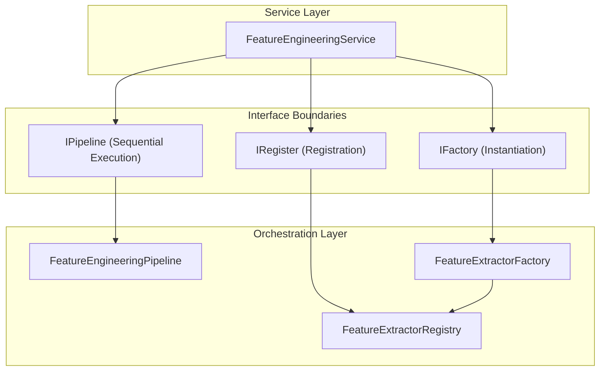

# Feature Engineering Foundation Component Diagram

## Book 04 — Feature Engineering | Milestone 4.1

The component layout diagram displays the logical blocks and interfaces in Book 04:

```mermaid
graph TD
    subgraph Service Layer
        Service["FeatureEngineeringService"]
    end

    subgraph Orchestration Layer
        Pipeline["FeatureEngineeringPipeline"]
        Factory["FeatureExtractorFactory"]
        Registry["FeatureExtractorRegistry"]
    end

    subgraph Interface Boundaries
        IFactory["IFactory (Instantiation)"]
        IRegister["IRegister (Registration)"]
        IPipeline["IPipeline (Sequential Execution)"]
    end

    Service --> IFactory
    Service --> IRegister
    Service --> IPipeline

    IFactory --> Factory
    IRegister --> Registry
    IPipeline --> Pipeline

    Factory --> Registry
```
