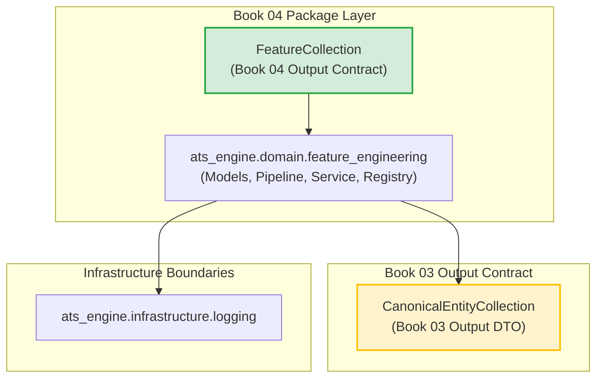

# Feature Engineering Foundation Dependency Graph

## Book 04 — Feature Engineering | Milestone 4.1

The dependency flow diagram highlights the strict one-way direction of imports:

```mermaid
graph TD
    subgraph "Book 04 Package Layer"
        FeatureCollection["FeatureCollection<br/>(Book 04 Output Contract)"]
        FeatureEngineering["ats_engine.domain.feature_engineering<br/>(Models, Pipeline, Service, Registry)"]
    end

    subgraph "Book 03 Output Contract"
        CanonicalCollection["CanonicalEntityCollection<br/>(Book 03 Output DTO)"]
    end

    subgraph "Infrastructure Boundaries"
        Logging["ats_engine.infrastructure.logging"]
    end

    FeatureCollection --> FeatureEngineering
    FeatureEngineering --> CanonicalCollection
    FeatureEngineering --> Logging

    %% Violations Guards
    style FeatureCollection fill:#d4edda,stroke:#28a745,stroke-width:2px
    style CanonicalCollection fill:#fff3cd,stroke:#ffc107,stroke-width:2px
```
