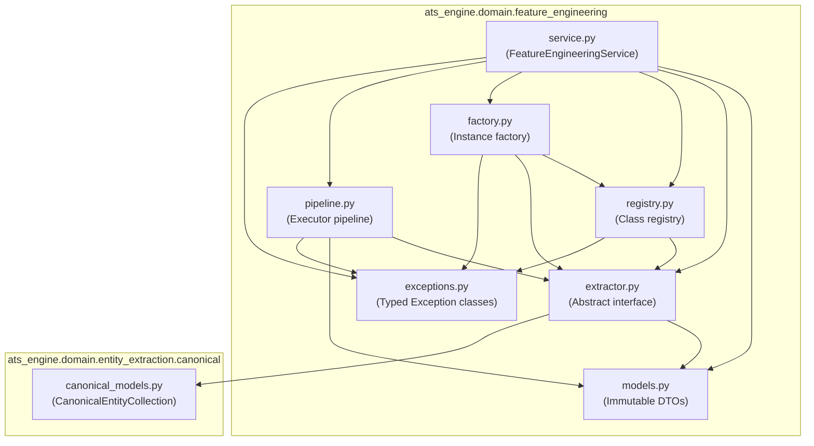

# Feature Engineering Foundation Package Diagram

## Book 04 — Feature Engineering | Milestone 4.1

The package boundaries mapping illustrates the logical sub-folders and class distributions in Book 04:

