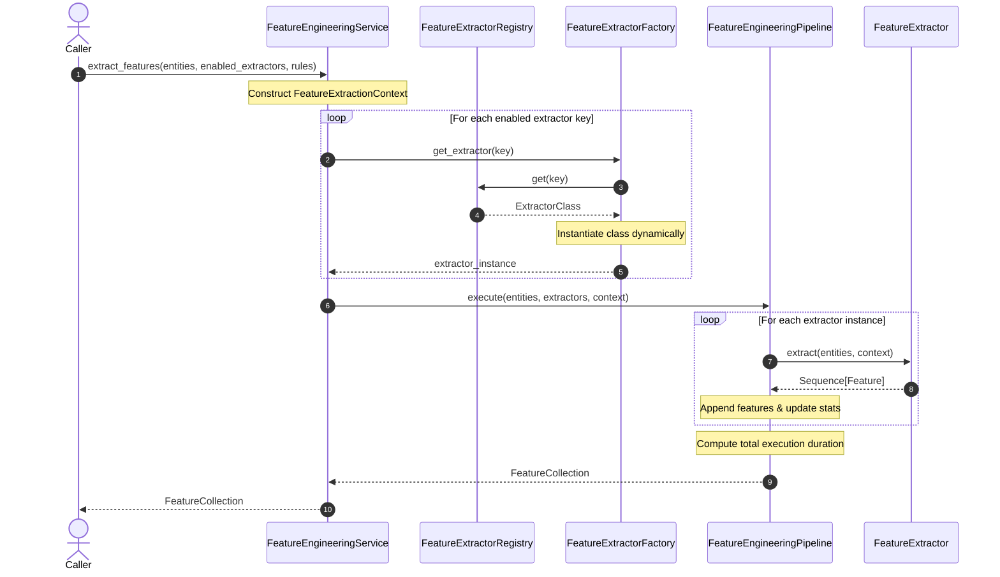

# Feature Engineering Foundation Sequence Diagram

## Book 04 — Feature Engineering | Milestone 4.1

The sequence diagram below displays the execution timeline for extracting features via the pipeline:

