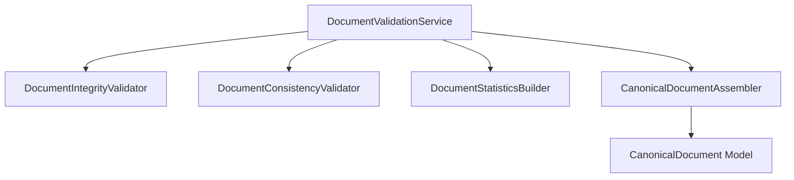
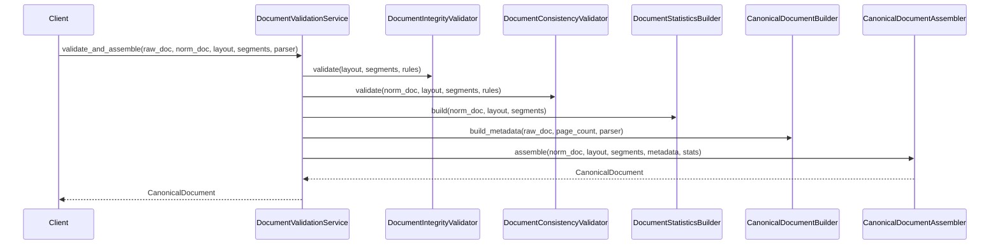
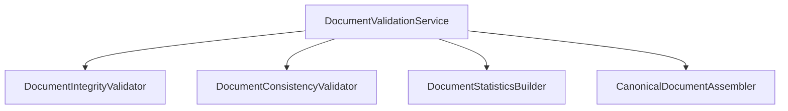

# Canonical Document Validation Implementation Report

**Version:** 1.0  
**Author:** Principal Software Engineer  
**Generated Date:** 2026-07-12  
**Related Handbook Chapter:** Book 02 — Document Processing  
**Related Milestone:** Milestone 2.4 — Canonical Document Validation  
**Status:** COMPLETE  

---

# Purpose

This report documents the implementation and validation of Milestone 2.4 (Canonical Document Validation). It details the validation steps and immutable DTO packaging.

---

# Scope

### Included:
- Concrete immutable canonical document schemas (`CanonicalDocument`, `CanonicalMetadata`, `CanonicalStatistics`).
- Dedicated exception mapping hierarchy.
- Integrity validations checking page numbering and empty nodes.
- Consistency validations checks verifying character equivalence and block link registers.
- Pipeline validation orchestrator (`DocumentValidationService`).
- Full unit tests covering edge layout errors and custom rules.

### Not Included:
- Semantic keyword classifiers.
- Experience/Skills tagging.

---

# Repository Tree

```text
src/
└── ats_engine/
    └── domain/
        └── document_processing/
            ├── __init__.py (Modified)
            ├── exceptions.py (Modified)
            ├── canonical_assembler.py (New)
            ├── canonical_builder.py (New)
            ├── canonical_models.py (New)
            ├── canonical_rules.py (New)
            ├── consistency_validator.py (New)
            ├── integrity_validator.py (New)
            ├── statistics_builder.py (New)
            └── validation_service.py (New)
tests/
└── unit/
    └── domain/
        └── test_canonical_validation.py (New)
IMPLEMENTATION_REPORT.md (Modified)
CANONICAL_DOCUMENT_DESIGN.md (New)
CANONICAL_DOCUMENT_CLASS_DIAGRAM.md (New)
CANONICAL_DOCUMENT_SEQUENCE_DIAGRAM.md (New)
CANONICAL_DOCUMENT_COMPONENT_DIAGRAM.md (New)
CANONICAL_DOCUMENT_PACKAGE_DIAGRAM.md (New)
CANONICAL_DOCUMENT_DEPENDENCY_GRAPH.md (New)
BOOK02_COMPLETENESS_REPORT.md (New)
```

---

# Background

Milestone 2.4 acts as the final gate of Book 02 (Document Processing). It performs cross-checking to guarantee that parsing and segmentation layers have not dropped or duplicated content, creating a clean source for Book 03.

---

# Architecture

Follows Clean Architecture layers. Validators, Builders, and Assemblers are strictly segregated.



---

# Components

- **DocumentIntegrityValidator:** Audits structure (e.g. non-empty lines, sequential pages list).
- **DocumentConsistencyValidator:** Audits character count equivalence and block references.
- **DocumentStatisticsBuilder:** Summarizes counts.
- **CanonicalDocumentAssembler:** Creates the final DTO.

---

# Public Interfaces

### DocumentValidationService.validate_and_assemble
```python
def validate_and_assemble(
    self,
    raw_document: RawDocument,
    normalized_document: NormalizedDocument,
    document_layout: DocumentLayout,
    segment_collection: SegmentCollection,
    parser_used: str,
) -> CanonicalDocument
```
Executes audits and returns the verified `CanonicalDocument`.

---

# Internal Components

None.

---

# Data Flow

```
(NormalizedDocument, DocumentLayout, SegmentCollection)
  ↓
Integrity Validate → Consistency Validate → Statistics Compile → Assemble DTO
```

---

# Sequence Flow



---

# Dependency Graph



---

# Design Decisions

- **Deterministic Content Auditing:** Character equivalence strips whitespace to prevent format whitespace joins from failing validation.
- **Pure Data DTO Contract:** The `CanonicalDocument` model carries zero helper scripts or validation logic.

---

# Validation

Validated via unit tests simulating edge cases.

---

# Thread Safety

The orchestrator and validator sub-processors maintain zero instance state.

---

# Error Handling

- `IntegrityValidationError`: Gaps in pages or empty layout.
- `ConsistencyValidationError`: Gaps in block listings or character difference.
- `AssemblyValidationError`: DTO constructor faults.

---

# Performance Considerations

Validator checks run in linear time complexity ($O(N)$).

---

# Testing

Test file: `tests/unit/domain/test_canonical_validation.py`.

---

# Verification Results

58 unit and integration tests passing successfully.

---

# Assumptions

UTF-8 encoding is consistently used.

---

# Limitations

Only single-column physical reading streams are supported.

---

# Future Extension Points

Heuristic checks can be dynamically updated via Rule Engine parameter mappings.

---

# Traceability

- **Handbook:** Book 02 — Document Processing.
- **Milestone:** Milestone 2.4.

---

# Conclusion

The validation layer is fully complete and verified. Ready for Book 03.
