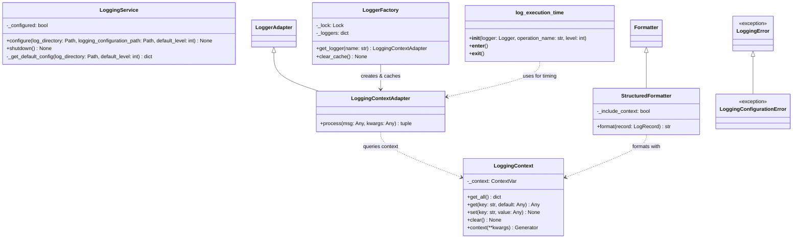

# Logging Class Diagram

```mermaid
classDiagram
    class LoggingService {
        -_configured: bool
        +configure(log_directory: Path, logging_configuration_path: Path, default_level: int) None
        +shutdown() None
        -_get_default_config(log_directory: Path, default_level: int) dict
    }

    class LoggerFactory {
        -_lock: Lock
        -_loggers: dict
        +get_logger(name: str) LoggingContextAdapter
        +clear_cache() None
    }

    class LoggingContext {
        -_context: ContextVar
        +get_all() dict
        +get(key: str, default: Any) Any
        +set(key: str, value: Any) None
        +clear() None
        +context(**kwargs) Generator
    }

    class LoggingContextAdapter {
        +process(msg: Any, kwargs: Any) tuple
    }

    class StructuredFormatter {
        -_include_context: bool
        +format(record: LogRecord) str
    }

    class log_execution_time {
        +__init__(logger: Logger, operation_name: str, level: int)
        +__enter__()
        +__exit__()
    }

    class LoggingError {
        <<exception>>
    }

    class LoggingConfigurationError {
        <<exception>>
    }

    LoggerAdapter <|-- LoggingContextAdapter
    Formatter <|-- StructuredFormatter
    LoggingError <|-- LoggingConfigurationError
    LoggerFactory --> LoggingContextAdapter : creates & caches
    LoggingContextAdapter ..> LoggingContext : queries context
    StructuredFormatter ..> LoggingContext : formats with
    log_execution_time ..> LoggingContextAdapter : uses for timing
```
