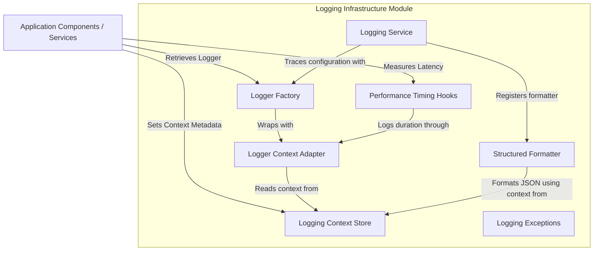

# Logging Component Diagram

```mermaid
flowchart TD
    subgraph LoggingInfrastructure [Logging Infrastructure Module]
        LS[Logging Service]
        LF[Logger Factory]
        LA[Logger Context Adapter]
        LC[Logging Context Store]
        SF[Structured Formatter]
        PE[Performance Timing Hooks]
        EX[Logging Exceptions]
    end

    App[Application Components / Services] -->|Retrieves Logger| LF
    App -->|Sets Context Metadata| LC
    App -->|Measures Latency| PE
    
    LF -->|Wraps with| LA
    LA -->|Reads context from| LC
    LS -->|Registers formatter| SF
    SF -->|Formats JSON using context from| LC
    LS -->|Traces configuration with| LF
    PE -->|Logs duration through| LA
```
