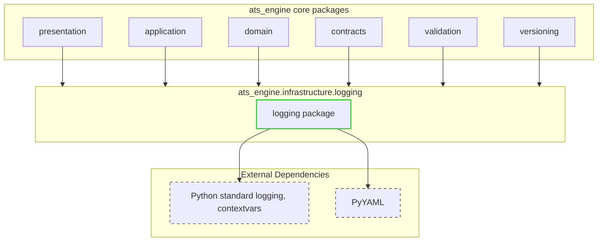

# Logging Dependency Graph

```mermaid
flowchart TD
    subgraph Logging [ats_engine.infrastructure.logging]
        LoggingPackage[logging package]
    end

    subgraph Core [ats_engine core packages]
        Presentation[presentation]
        Application[application]
        Domain[domain]
        Contracts[contracts]
        Validation[validation]
        Versioning[versioning]
    end

    subgraph External [External Dependencies]
        StdLib[Python standard logging, contextvars]
        PyYAML[PyYAML]
    end

    %% Dependency Direction Rules
    Presentation --> Logging
    Application --> Logging
    Domain --> Logging
    Contracts --> Logging
    Validation --> Logging
    Versioning --> Logging

    LoggingPackage --> StdLib
    LoggingPackage --> PyYAML

    %% Integrity assertions
    classDef safe stroke:#33cc33,stroke-width:2px;
    classDef external stroke:#333,stroke-dasharray: 5 5;
    class LoggingPackage safe;
    class StdLib,PyYAML external;
```
