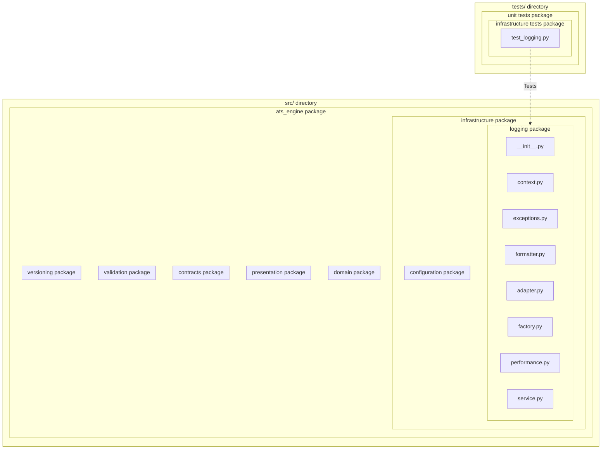

# Logging Package Diagram

```mermaid
flowchart TD
    subgraph src [src/ directory]
        subgraph ats_engine [ats_engine package]
            subgraph infrastructure [infrastructure package]
                subgraph logging [logging package]
                    __init__.py
                    context.py
                    exceptions.py
                    formatter.py
                    adapter.py
                    factory.py
                    performance.py
                    service.py
                end
                subgraph configuration [configuration package]
                end
            end
            subgraph domain [domain package]
            end
            subgraph presentation [presentation package]
            end
            subgraph contracts [contracts package]
            end
            subgraph validation [validation package]
            end
            subgraph versioning [versioning package]
            end
        end
    end
    
    subgraph tests [tests/ directory]
        subgraph unit [unit tests package]
            subgraph unit_infra [infrastructure tests package]
                test_logging.py
            end
        end
    end

    test_logging.py -.->|Tests| logging
```
