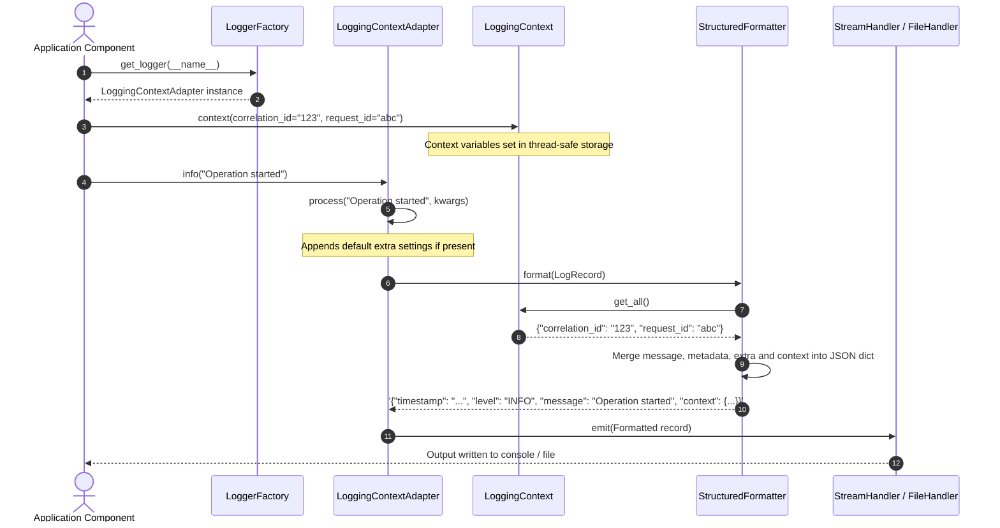

# Logging Sequence Diagram

```mermaid
sequenceDiagram
    autonumber
    actor App as Application Component
    participant LF as LoggerFactory
    participant LA as LoggingContextAdapter
    participant LC as LoggingContext
    participant SF as StructuredFormatter
    participant SH as StreamHandler / FileHandler

    App->>LF: get_logger(__name__)
    LF-->>App: LoggingContextAdapter instance
    App->>LC: context(correlation_id="123", request_id="abc")
    Note over LC: Context variables set in thread-safe storage

    App->>LA: info("Operation started")
    LA->>LA: process("Operation started", kwargs)
    Note over LA: Appends default extra settings if present
    LA->>SF: format(LogRecord)
    SF->>LC: get_all()
    LC-->>SF: {"correlation_id": "123", "request_id": "abc"}
    SF->>SF: Merge message, metadata, extra and context into JSON dict
    SF-->>LA: '{"timestamp": "...", "level": "INFO", "message": "Operation started", "context": {...}}'
    LA->>SH: emit(Formatted record)
    SH-->>App: Output written to console / file
```
