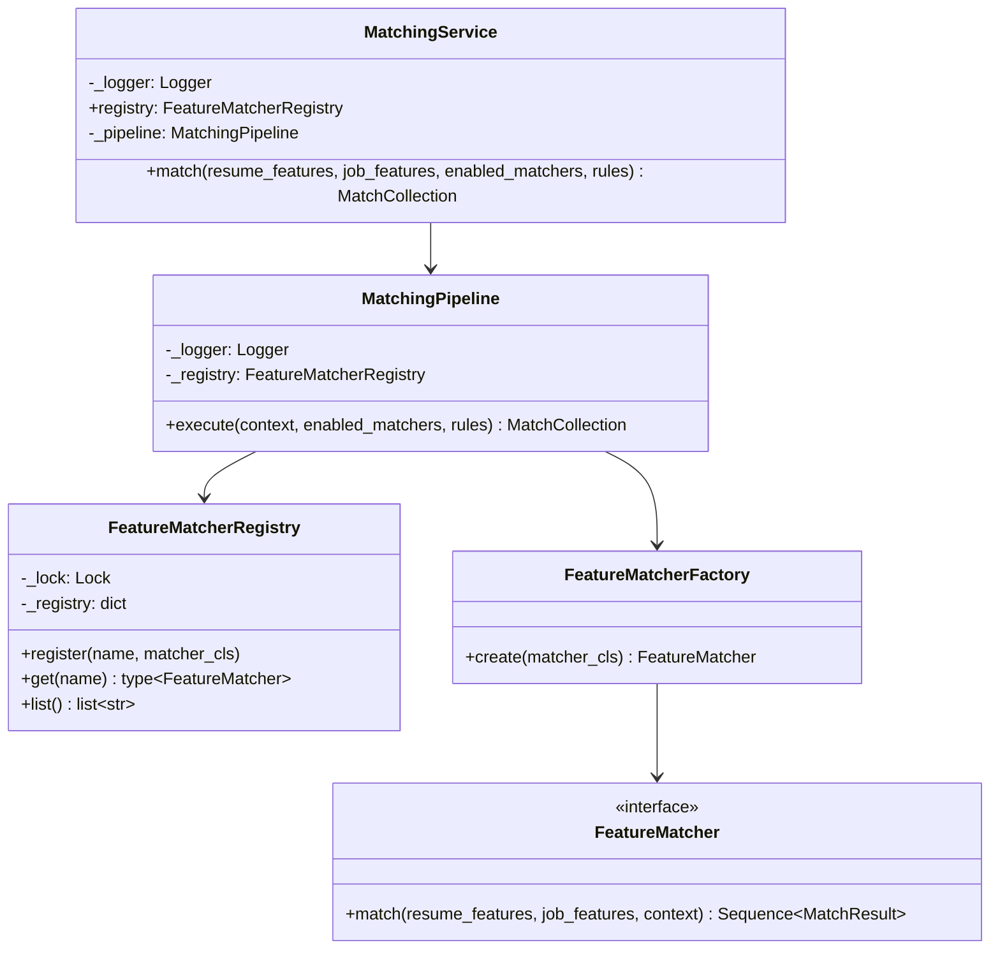

# Matching Foundation Class Diagram

## Book 05 — Matching Engine | Milestone 5.1

The class diagram outlines the interfaces and helper classes supporting `MatchingService`:

```mermaid
classDiagram
    class MatchingService {
        -_logger: Logger
        +registry: FeatureMatcherRegistry
        -_pipeline: MatchingPipeline
        +match(resume_features, job_features, enabled_matchers, rules) MatchCollection
    }

    class MatchingPipeline {
        -_logger: Logger
        -_registry: FeatureMatcherRegistry
        +execute(context, enabled_matchers, rules) MatchCollection
    }

    class FeatureMatcher {
        <<interface>>
        +match(resume_features, job_features, context) Sequence~MatchResult~
    }

    class FeatureMatcherRegistry {
        -_lock: Lock
        -_registry: dict
        +register(name, matcher_cls)
        +get(name) type~FeatureMatcher~
        +list() list~str~
    }

    class FeatureMatcherFactory {
        +create(matcher_cls) FeatureMatcher
    }

    MatchingService --> MatchingPipeline
    MatchingPipeline --> FeatureMatcherRegistry
    MatchingPipeline --> FeatureMatcherFactory
    FeatureMatcherFactory --> FeatureMatcher
```
