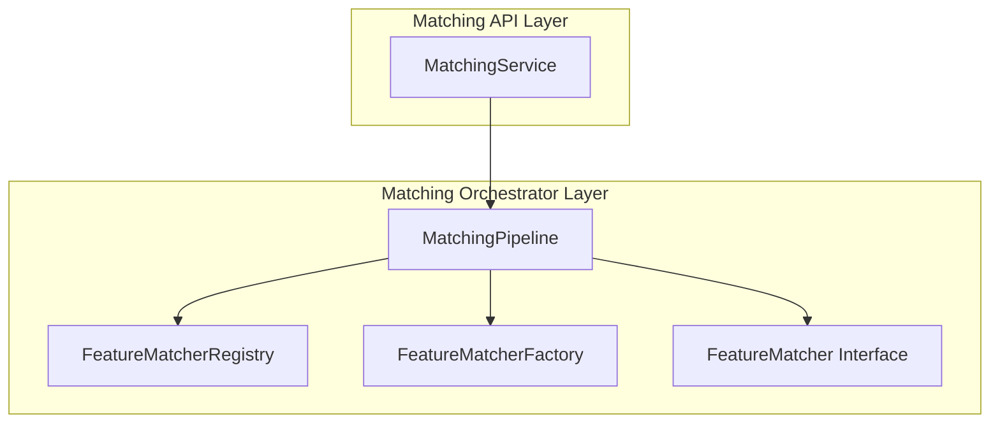

# Matching Foundation Component Diagram

## Book 05 — Matching Engine | Milestone 5.1

The component architecture details dependencies within the matching context:

```mermaid
graph TD
    subgraph "Matching API Layer"
        Service["MatchingService"]
    end

    subgraph "Matching Orchestrator Layer"
        Pipeline["MatchingPipeline"]
        Registry["FeatureMatcherRegistry"]
        Factory["FeatureMatcherFactory"]
        Matcher["FeatureMatcher Interface"]
    end

    Service --> Pipeline
    Pipeline --> Registry
    Pipeline --> Factory
    Pipeline --> Matcher
```
