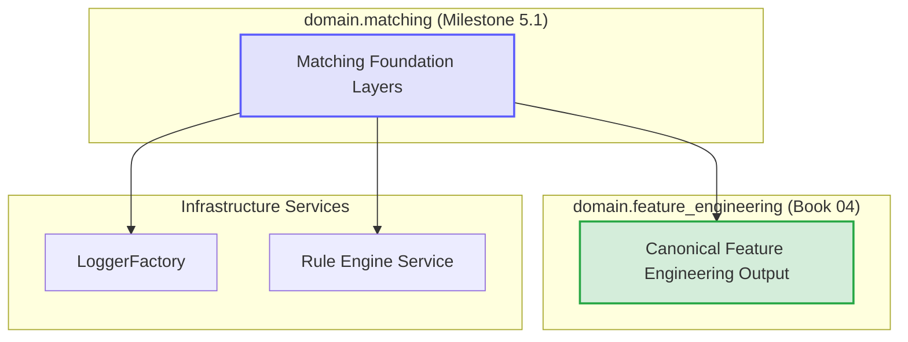

# Matching Foundation Dependency Graph

## Book 05 — Matching Engine | Milestone 5.1

The dependency graph illustrates strict one-way dependency boundaries:

```mermaid
graph TD
    subgraph "domain.matching (Milestone 5.1)"
        MatchingFoundation["Matching Foundation Layers"]
    end

    subgraph "domain.feature_engineering (Book 04)"
        CanonicalFeature["Canonical Feature Engineering Output"]
    end

    subgraph "Infrastructure Services"
        Logging["LoggerFactory"]
        RuleEngine["Rule Engine Service"]
    end

    MatchingFoundation --> CanonicalFeature
    MatchingFoundation --> Logging
    MatchingFoundation --> RuleEngine

    %% Style configurations
    style MatchingFoundation fill:#e2e2fc,stroke:#5c5cfc,stroke-width:2px
    style CanonicalFeature fill:#d4edda,stroke:#28a745,stroke-width:2px
```
