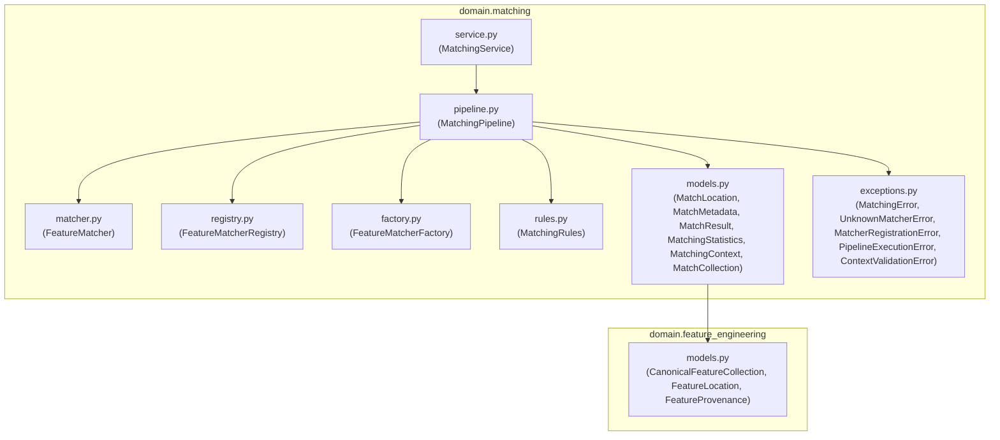

# Matching Foundation Package Diagram

## Book 05 — Matching Engine | Milestone 5.1

The package diagram shows files structured under the `matching` folder:

```mermaid
graph TD
    subgraph "domain.matching"
        Service["service.py<br/>(MatchingService)"]
        Pipeline["pipeline.py<br/>(MatchingPipeline)"]
        Matcher["matcher.py<br/>(FeatureMatcher)"]
        Registry["registry.py<br/>(FeatureMatcherRegistry)"]
        Factory["factory.py<br/>(FeatureMatcherFactory)"]
        Rules["rules.py<br/>(MatchingRules)"]
        Models["models.py<br/>(MatchLocation, MatchMetadata, MatchResult, MatchingStatistics, MatchingContext, MatchCollection)"]
        Exceptions["exceptions.py<br/>(MatchingError, UnknownMatcherError, MatcherRegistrationError, PipelineExecutionError, ContextValidationError)"]
    end

    subgraph "domain.feature_engineering"
        BaseModels["models.py<br/>(CanonicalFeatureCollection, FeatureLocation, FeatureProvenance)"]
    end

    Service --> Pipeline
    Pipeline --> Matcher
    Pipeline --> Registry
    Pipeline --> Factory
    Pipeline --> Rules
    Pipeline --> Models
    Pipeline --> Exceptions

    Models --> BaseModels
```
