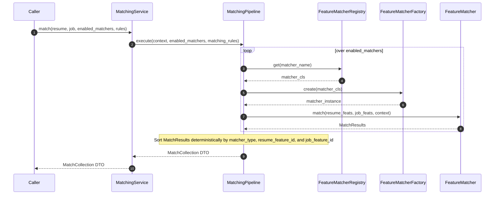

# Matching Foundation Sequence Diagram

## Book 05 — Matching Engine | Milestone 5.1

The sequence diagram details comparison runs within the pipeline execution context:

```mermaid
sequenceDiagram
    autonumber
    participant Caller
    participant Service as MatchingService
    participant Pipeline as MatchingPipeline
    participant Registry as FeatureMatcherRegistry
    participant Factory as FeatureMatcherFactory
    participant Matcher as FeatureMatcher

    Caller ->> Service: match(resume, job, enabled_matchers, rules)
    Service ->> Pipeline: execute(context, enabled_matchers, matching_rules)
    Loop over enabled_matchers
        Pipeline ->> Registry: get(matcher_name)
        Registry -->> Pipeline: matcher_cls
        Pipeline ->> Factory: create(matcher_cls)
        Factory -->> Pipeline: matcher_instance
        Pipeline ->> Matcher: match(resume_feats, job_feats, context)
        Matcher -->> Pipeline: MatchResults
    End
    Note over Pipeline: Sort MatchResults deterministically by matcher_type, resume_feature_id, and job_feature_id
    Pipeline -->> Service: MatchCollection DTO
    Service -->> Caller: MatchCollection DTO
```
