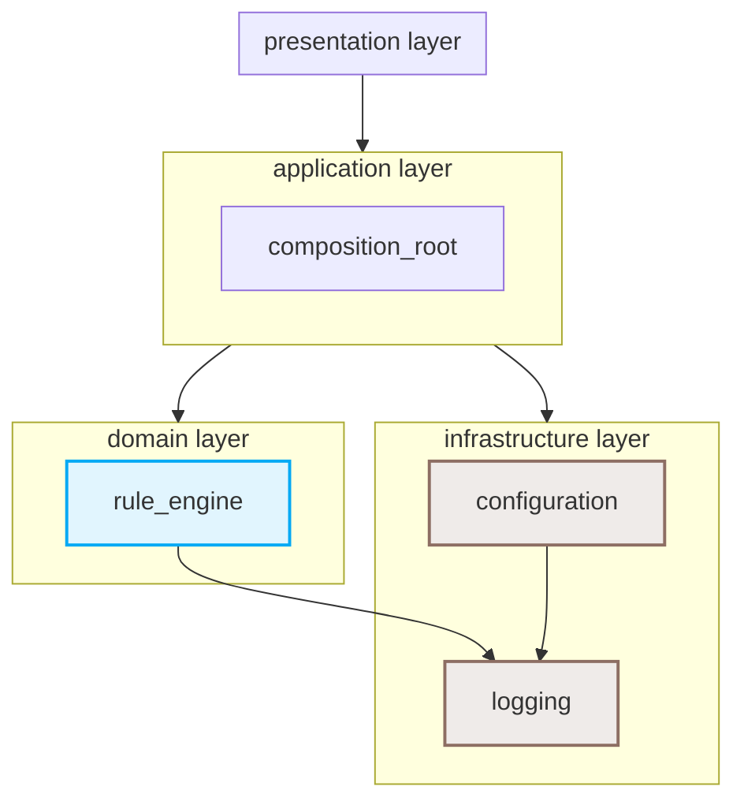

# Package Dependency Graph

```mermaid
flowchart TD
    subgraph presentation [presentation layer]
    end

    subgraph application [application layer]
        CR[composition_root]
    end

    subgraph domain [domain layer]
        RuleEngine[rule_engine]
    end

    subgraph infrastructure [infrastructure layer]
        Config[configuration]
        Logging[logging]
    end

    %% Verification rules
    presentation --> application
    application --> domain
    application --> infrastructure
    
    RuleEngine --> Logging
    Config --> Logging

    %% Style classes
    classDef domainClass fill:#e1f5fe,stroke:#03a9f4,stroke-width:2px;
    classDef infraClass fill:#efebe9,stroke:#8d6e63,stroke-width:2px;
    class RuleEngine domainClass;
    class Config,Logging infraClass;
```
