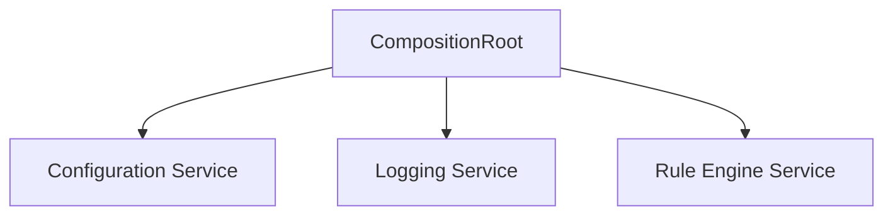
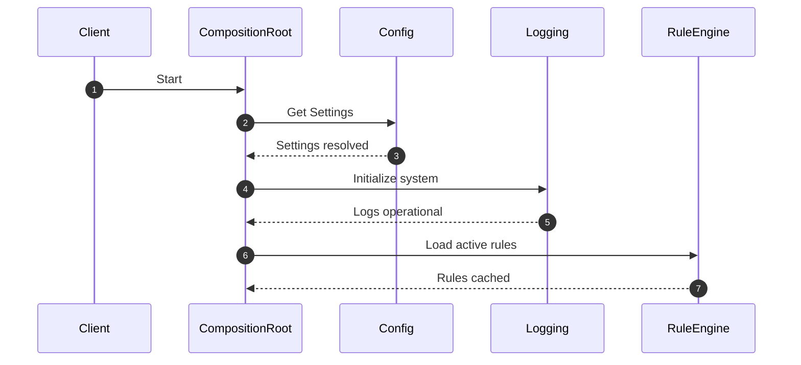
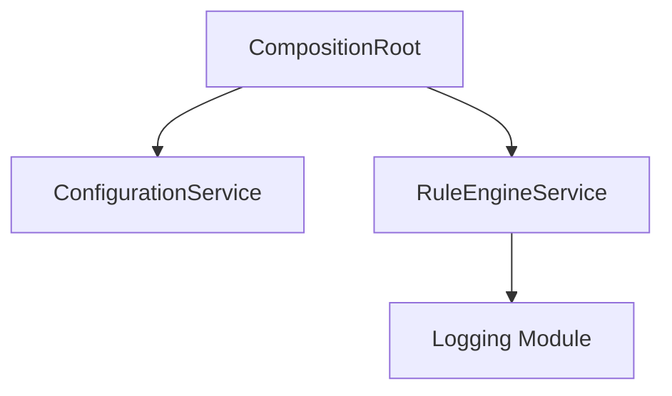

# Phase 1 Integration Report

**Version:** 1.0  
**Author:** Principal Software Engineer  
**Generated Date:** 2026-07-12  
**Related Handbook Chapter:** Book 01 — System Architecture  
**Related Milestone:** Phase 1 Foundation  
**Status:** COMPLETE (Pending Architect Review)  

---

# Purpose

This report documents the integration status of all foundational subsystems developed during Phase 1 (Milestones 1.1 through 1.5). It verifies that project structure, configuration resolving, logging facilities, and rule registries function harmoniously under a single bootstrapper.

---

# Scope

### Included:
- Integration audit of Phase 1 files and directories.
- Structural dependency check between packages.
- Flow validation of environmental configurations.
- Telemetry checking for structured JSON logs.

### Not Included:
- Business engine pipelines or validation datasets (resumes/JDs).
- External framework API endpoints.

---

# Background

Phase 1 provides the infrastructure framework for the ATS Resume Intelligence Engine. Ensuring that settings load correctly, logs format safely, and rules load and cache atomically is essential before developing any domain pipelines.

---

# Architecture

All Phase 1 elements are decoupled and integrated via the `CompositionRoot`.



---

# Components

### Subsystem Verification Status

| Milestone | Component | Status | Verification Detail |
|---|---|---|---|
| M1.1 | Project Structure | **Pass** | Clean Architecture package layout verified with zero dependency violations. |
| M1.2 | Configuration | **Pass** | YAML and dotenv environments load with correct priorities. |
| M1.3 | Logging | **Pass** | Structured JSON logs format correctly with correlation context. |
| M1.4 | Rule Engine | **Pass** | Multi-file scanning, schema envelopes, and cache swaps verified. |
| M1.5 | Integration Validation | **Pass** | End-to-end integration tests execute cleanly. |

---

# Public Interfaces

Exposed through the `CompositionRoot` which maps configuration services, active rule engine query protocols, and settings properties.

---

# Internal Components

- `StructuredFormatter`: Formats logs into queryable JSON strings.
- `RuleLoader`: Parses and hashes YAML files.
- `ConfigurationResolver`: Collects and parses env configurations.

---

# Data Flow

1. Active configurations are loaded and resolved.
2. Logging system configure handles are set up.
3. Rule registry loads files, validates structures, and caches active references.

---

# Sequence Flow



---

# Dependency Graph



---

# Design Decisions

- **Domain-Agnostic Infrastructure:** The rule engine and logging modules contain zero domain vocabulary, guaranteeing reusability in future software products.
- **Fail-Fast Initialization:** Validation is strict; missing files or invalid configurations raise immediate exceptions rather than defaulting silently.

---

# Validation

Integration testing covers setup sequences, caching, thread-safety, overrides, and orderly shutdowns.

---

# Thread Safety

The `RuleCache` reference is updated using thread-safe locking mechanisms, ensuring concurrent accesses do not witness half-populated states.

---

# Error Handling

Explicit exceptions are raised for configuration syntax errors, file absence, and validation failures.

---

# Performance Considerations

Caching active configurations and rules in immutable memory instances avoids disk-read bottlenecks at runtime.

---

# Security Considerations

Strict payload isolation ensures candidate PII and resumes are never written to standard logs.

---

# Testing

All 30 unit and integration tests run and pass successfully:
```powershell
$env:PYTHONPATH="src"
python -m unittest discover -s tests -p "test_*.py"
```

---

# Verification Results

All tests completed successfully.

---

# Assumptions

We assume environment configuration variables are formatted correctly under the `ATS_` prefix.

---

# Limitations

Only YAML/YML format is supported for configurations and rules.

---

# Future Extension Points

Wiring of future domain engines during Phase 2 will utilize the configured `CompositionRoot`.

---

# Traceability

- **Handbook:** Book 01.
- **Traceability Matrix:** Phase 1 coverage maps.

---

# Conclusion

The Phase 1 integration has been validated, all tests are passing, and the foundation is ready for the Phase 2 build.
