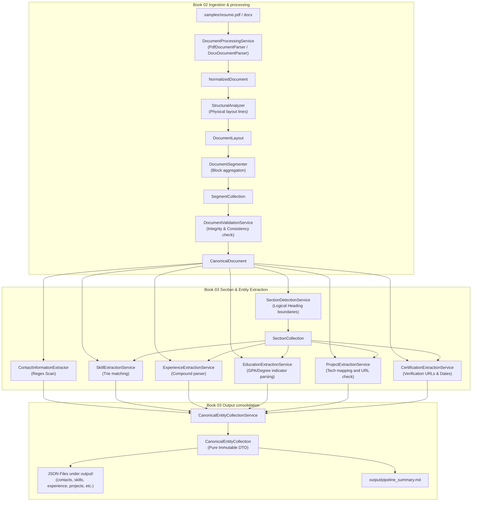

# Pipeline Execution Diagram

## Book 03 — Entity Extraction | Pipeline Validation

The diagram below details the sequential, synchronized execution flow of the E2E runner:

```mermaid
graph TD
    subgraph "Book 02 Ingestion & processing"
        INPUT["samples/resume.pdf / docx"]
        PARSER["DocumentProcessingService<br/>(PdfDocumentParser / DocxDocumentParser)"]
        NORM["NormalizedDocument"]
        ANALYZER["StructuralAnalyzer<br/>(Physical layout lines)"]
        LAYOUT["DocumentLayout"]
        SEGMENTER["DocumentSegmenter<br/>(Block aggregation)"]
        SEGMENTS["SegmentCollection"]
        VALIDATOR["DocumentValidationService<br/>(Integrity & Consistency check)"]
        CAN_DOC["CanonicalDocument"]
    end

    subgraph "Book 03 Section & Entity Extraction"
        SECTIONS["SectionDetectionService<br/>(Logical Heading boundaries)"]
        SEC_COLL["SectionCollection"]

        CONTACTS["ContactInformationExtractor<br/>(Regex Scan)"]
        SKILLS["SkillExtractionService<br/>(Trie matching)"]
        EXPERIENCE["ExperienceExtractionService<br/>(Compound parser)"]
        EDUCATION["EducationExtractionService<br/>(GPA/Degree indicator parsing)"]
        PROJECTS["ProjectExtractionService<br/>(Tech mapping and URL check)"]
        CERTIFICATIONS["CertificationExtractionService<br/>(Verification URLs & Dates)"]
    end

    subgraph "Book 03 Output consolidation"
        BUILDER["CanonicalEntityCollectionService"]
        CEC["CanonicalEntityCollection<br/>(Pure Immutable DTO)"]
        JSONS["JSON Files under output/<br/>(contacts, skills, experience, projects, etc.)"]
        MD_SUMM["output/pipeline_summary.md"]
    end

    INPUT --> PARSER
    PARSER --> NORM
    NORM --> ANALYZER
    ANALYZER --> LAYOUT
    LAYOUT --> SEGMENTER
    SEGMENTER --> SEGMENTS
    SEGMENTS --> VALIDATOR
    VALIDATOR --> CAN_DOC

    CAN_DOC --> SECTIONS
    SECTIONS --> SEC_COLL

    CAN_DOC --> CONTACTS
    CAN_DOC --> SKILLS
    CAN_DOC --> EXPERIENCE
    CAN_DOC --> EDUCATION
    CAN_DOC --> PROJECTS
    CAN_DOC --> CERTIFICATIONS

    SEC_COLL --> SKILLS
    SEC_COLL --> EXPERIENCE
    SEC_COLL --> EDUCATION
    SEC_COLL --> PROJECTS
    SEC_COLL --> CERTIFICATIONS

    CONTACTS --> BUILDER
    SKILLS --> BUILDER
    EXPERIENCE --> BUILDER
    EDUCATION --> BUILDER
    PROJECTS --> BUILDER
    CERTIFICATIONS --> BUILDER

    BUILDER --> CEC
    CEC --> JSONS
    CEC --> MD_SUMM
```
