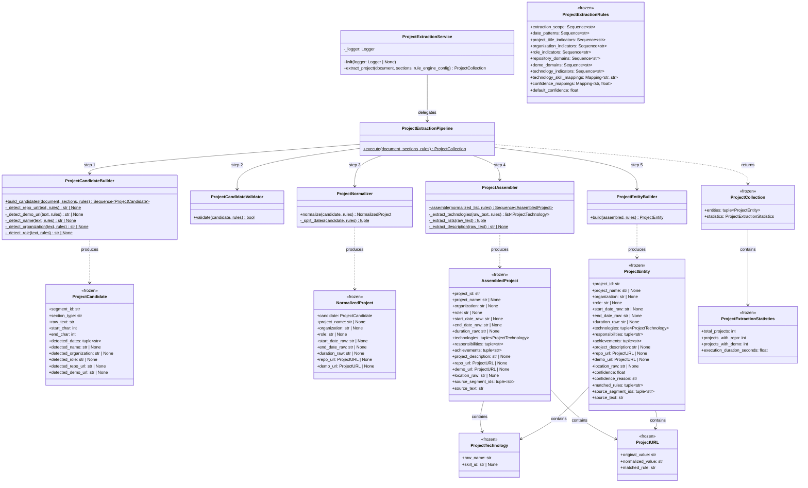

# Project Extraction Class Diagram

## Book 03 — Entity Extraction | Milestone 3.7

```mermaid
classDiagram
    class ProjectExtractionService {
        -_logger: Logger
        +__init__(logger: Logger | None)
        +extract_project(document, sections, rule_engine_config) ProjectCollection
    }

    class ProjectExtractionPipeline {
        +execute(document, sections, rules)$ ProjectCollection
    }

    class ProjectCandidateBuilder {
        +build_candidates(document, sections, rules)$ Sequence~ProjectCandidate~
        -_detect_repo_url(text, rules)$ str | None
        -_detect_demo_url(text, rules)$ str | None
        -_detect_name(text, rules)$ str | None
        -_detect_organization(text, rules)$ str | None
        -_detect_role(text, rules)$ str | None
    }

    class ProjectCandidateValidator {
        +validate(candidate, rules)$ bool
    }

    class ProjectNormalizer {
        +normalize(candidate, rules)$ NormalizedProject
        -_split_dates(candidate, rules)$ tuple
    }

    class ProjectAssembler {
        +assemble(normalized_list, rules)$ Sequence~AssembledProject~
        -_extract_technologies(raw_text, rules)$ list~ProjectTechnology~
        -_extract_lists(raw_text)$ tuple
        -_extract_description(raw_text)$ str | None
    }

    class ProjectEntityBuilder {
        +build(assembled, rules)$ ProjectEntity
    }

    class ProjectExtractionRules {
        <<frozen>>
        +extraction_scope: Sequence~str~
        +date_patterns: Sequence~str~
        +project_title_indicators: Sequence~str~
        +organization_indicators: Sequence~str~
        +role_indicators: Sequence~str~
        +repository_domains: Sequence~str~
        +demo_domains: Sequence~str~
        +technology_indicators: Sequence~str~
        +technology_skill_mappings: Mapping~str, str~
        +confidence_mappings: Mapping~str, float~
        +default_confidence: float
    }

    class ProjectCandidate {
        <<frozen>>
        +segment_id: str
        +section_type: str
        +raw_text: str
        +start_char: int
        +end_char: int
        +detected_dates: tuple~str~
        +detected_name: str | None
        +detected_organization: str | None
        +detected_role: str | None
        +detected_repo_url: str | None
        +detected_demo_url: str | None
    }

    class NormalizedProject {
        <<frozen>>
        +candidate: ProjectCandidate
        +project_name: str | None
        +organization: str | None
        +role: str | None
        +start_date_raw: str | None
        +end_date_raw: str | None
        +duration_raw: str | None
        +repo_url: ProjectURL | None
        +demo_url: ProjectURL | None
    }

    class AssembledProject {
        <<frozen>>
        +project_id: str
        +project_name: str | None
        +organization: str | None
        +role: str | None
        +start_date_raw: str | None
        +end_date_raw: str | None
        +duration_raw: str | None
        +technologies: tuple~ProjectTechnology~
        +responsibilities: tuple~str~
        +achievements: tuple~str~
        +project_description: str | None
        +repo_url: ProjectURL | None
        +demo_url: ProjectURL | None
        +location_raw: str | None
        +source_segment_ids: tuple~str~
        +source_text: str
    }

    class ProjectEntity {
        <<frozen>>
        +project_id: str
        +project_name: str | None
        +organization: str | None
        +role: str | None
        +start_date_raw: str | None
        +end_date_raw: str | None
        +duration_raw: str | None
        +technologies: tuple~ProjectTechnology~
        +responsibilities: tuple~str~
        +achievements: tuple~str~
        +project_description: str | None
        +repo_url: ProjectURL | None
        +demo_url: ProjectURL | None
        +location_raw: str | None
        +confidence: float
        +confidence_reason: str
        +matched_rules: tuple~str~
        +source_segment_ids: tuple~str~
        +source_text: str
    }

    class ProjectTechnology {
        <<frozen>>
        +raw_name: str
        +skill_id: str | None
    }

    class ProjectURL {
        <<frozen>>
        +original_value: str
        +normalized_value: str
        +matched_rule: str
    }

    class ProjectCollection {
        <<frozen>>
        +entities: tuple~ProjectEntity~
        +statistics: ProjectExtractionStatistics
    }

    class ProjectExtractionStatistics {
        <<frozen>>
        +total_projects: int
        +projects_with_repo: int
        +projects_with_demo: int
        +execution_duration_seconds: float
    }

    ProjectExtractionService --> ProjectExtractionPipeline : delegates
    ProjectExtractionPipeline --> ProjectCandidateBuilder : step 1
    ProjectExtractionPipeline --> ProjectCandidateValidator : step 2
    ProjectExtractionPipeline --> ProjectNormalizer : step 3
    ProjectExtractionPipeline --> ProjectAssembler : step 4
    ProjectExtractionPipeline --> ProjectEntityBuilder : step 5
    ProjectCandidateBuilder ..> ProjectCandidate : produces
    ProjectNormalizer ..> NormalizedProject : produces
    ProjectAssembler ..> AssembledProject : produces
    ProjectEntityBuilder ..> ProjectEntity : produces
    AssembledProject --> ProjectTechnology : contains
    AssembledProject --> ProjectURL : contains
    ProjectEntity --> ProjectTechnology : contains
    ProjectEntity --> ProjectURL : contains
    ProjectExtractionPipeline ..> ProjectCollection : returns
    ProjectCollection --> ProjectExtractionStatistics : contains
```
