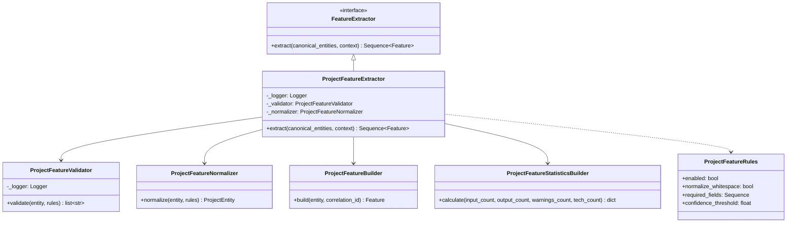

# Project Feature Engineering Class Diagram

## Book 04 — Feature Engineering | Milestone 4.5

The class diagram outlines the interfaces and helper classes supporting `ProjectFeatureExtractor`:

```mermaid
classDiagram
    class FeatureExtractor {
        <<interface>>
        +extract(canonical_entities, context) Sequence~Feature~
    }

    class ProjectFeatureExtractor {
        -_logger: Logger
        -_validator: ProjectFeatureValidator
        -_normalizer: ProjectFeatureNormalizer
        +extract(canonical_entities, context) Sequence~Feature~
    }

    class ProjectFeatureValidator {
        -_logger: Logger
        +validate(entity, rules) list~str~
    }

    class ProjectFeatureNormalizer {
        +normalize(entity, rules) ProjectEntity
    }

    class ProjectFeatureBuilder {
        +build(entity, correlation_id) Feature
    }

    class ProjectFeatureStatisticsBuilder {
        +calculate(input_count, output_count, warnings_count, tech_count) dict
    }

    class ProjectFeatureRules {
        +enabled: bool
        +normalize_whitespace: bool
        +required_fields: Sequence
        +confidence_threshold: float
    }

    FeatureExtractor <|-- ProjectFeatureExtractor
    ProjectFeatureExtractor --> ProjectFeatureValidator
    ProjectFeatureExtractor --> ProjectFeatureNormalizer
    ProjectFeatureExtractor --> ProjectFeatureBuilder
    ProjectFeatureExtractor --> ProjectFeatureStatisticsBuilder
    ProjectFeatureExtractor ..> ProjectFeatureRules
```
