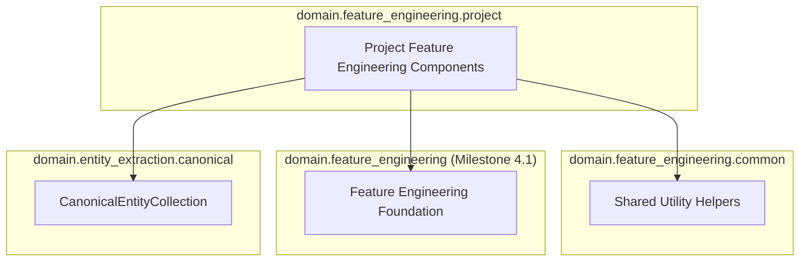

# Project Feature Engineering Dependency Graph

## Book 04 — Feature Engineering | Milestone 4.5

The dependency graph illustrates clean import structures and boundaries:

```mermaid
graph TD
    subgraph "domain.feature_engineering.project"
        ProjFeature["Project Feature Engineering Components"]
    end

    subgraph "domain.feature_engineering.common"
        CommonHelpers["Shared Utility Helpers"]
    end

    subgraph "domain.feature_engineering (Milestone 4.1)"
        BaseFoundation["Feature Engineering Foundation"]
    end

    subgraph "domain.entity_extraction.canonical"
        CanonicalModels["CanonicalEntityCollection"]
    end

    ProjFeature --> CommonHelpers
    ProjFeature --> BaseFoundation
    ProjFeature --> CanonicalModels
```
