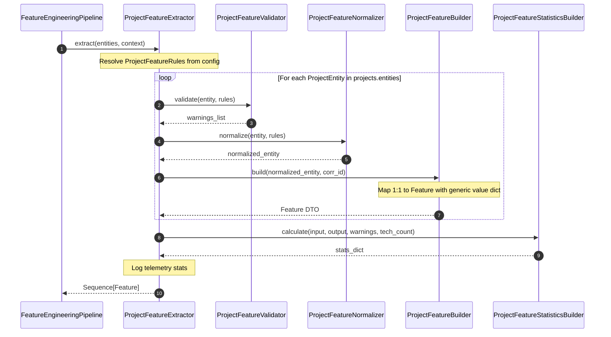

# Project Feature Engineering Sequence Diagram

## Book 04 — Feature Engineering | Milestone 4.5

The timeline sequence below depicts the execution flow during project feature extraction:

```mermaid
sequenceDiagram
    autonumber
    participant Pipeline as FeatureEngineeringPipeline
    participant Extractor as ProjectFeatureExtractor
    participant Validator as ProjectFeatureValidator
    participant Normalizer as ProjectFeatureNormalizer
    participant Builder as ProjectFeatureBuilder
    participant Stats as ProjectFeatureStatisticsBuilder

    Pipeline ->> Extractor: extract(entities, context)
    Note over Extractor: Resolve ProjectFeatureRules from config
    
    loop For each ProjectEntity in projects.entities
        Extractor ->> Validator: validate(entity, rules)
        Validator -->> Extractor: warnings_list
        Extractor ->> Normalizer: normalize(entity, rules)
        Normalizer -->> Extractor: normalized_entity
        Extractor ->> Builder: build(normalized_entity, corr_id)
        Note over Builder: Map 1:1 to Feature with generic value dict
        Builder -->> Extractor: Feature DTO
    end

    Extractor ->> Stats: calculate(input, output, warnings, tech_count)
    Stats -->> Extractor: stats_dict
    
    Note over Extractor: Log telemetry stats
    Extractor -->> Pipeline: Sequence[Feature]
```
