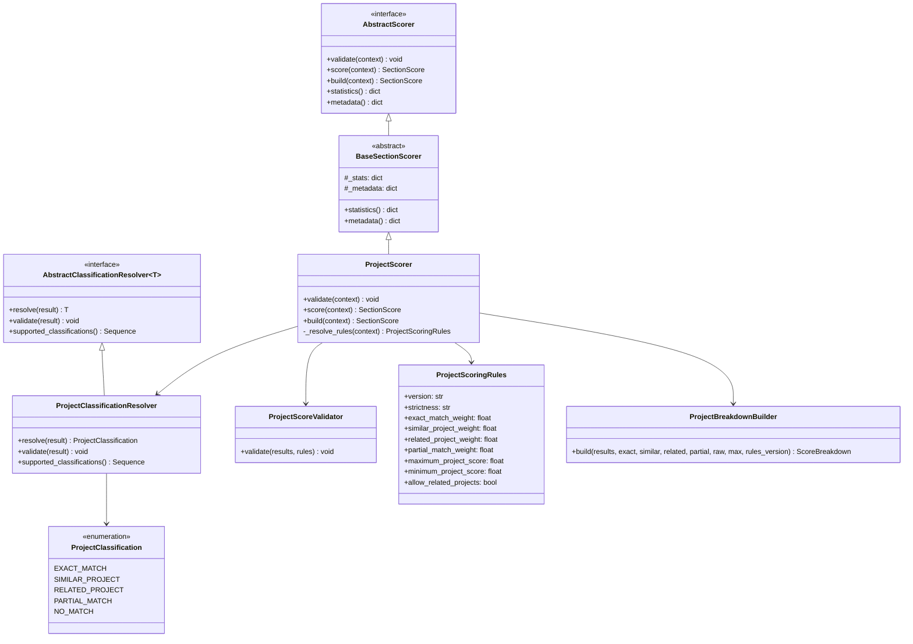

# Project Scorer Class Diagram

```mermaid
classDiagram
    direction TB
    class AbstractScorer {
        <<interface>>
        +validate(context) void
        +score(context) SectionScore
        +build(context) SectionScore
        +statistics() dict
        +metadata() dict
    }
    class BaseSectionScorer {
        <<abstract>>
        #_stats: dict
        #_metadata: dict
        +statistics() dict
        +metadata() dict
    }
    class ProjectScorer {
        +validate(context) void
        +score(context) SectionScore
        +build(context) SectionScore
        -_resolve_rules(context) ProjectScoringRules
    }
    class AbstractClassificationResolver~T~ {
        <<interface>>
        +resolve(result) T
        +validate(result) void
        +supported_classifications() Sequence
    }
    class ProjectClassificationResolver {
        +resolve(result) ProjectClassification
        +validate(result) void
        +supported_classifications() Sequence
    }
    class ProjectClassification {
        <<enumeration>>
        EXACT_MATCH
        SIMILAR_PROJECT
        RELATED_PROJECT
        PARTIAL_MATCH
        NO_MATCH
    }
    class ProjectScoreValidator {
        +validate(results, rules) void
    }
    class ProjectScoringRules {
        +version: str
        +strictness: str
        +exact_match_weight: float
        +similar_project_weight: float
        +related_project_weight: float
        +partial_match_weight: float
        +maximum_project_score: float
        +minimum_project_score: float
        +allow_related_projects: bool
    }
    class ProjectBreakdownBuilder {
        +build(results, exact, similar, related, partial, raw, max, rules_version) ScoreBreakdown
    }

    AbstractScorer <|-- BaseSectionScorer
    BaseSectionScorer <|-- ProjectScorer
    AbstractClassificationResolver <|-- ProjectClassificationResolver
    ProjectScorer --> ProjectClassificationResolver
    ProjectScorer --> ProjectScoreValidator
    ProjectScorer --> ProjectScoringRules
    ProjectScorer --> ProjectBreakdownBuilder
    ProjectClassificationResolver --> ProjectClassification
```
