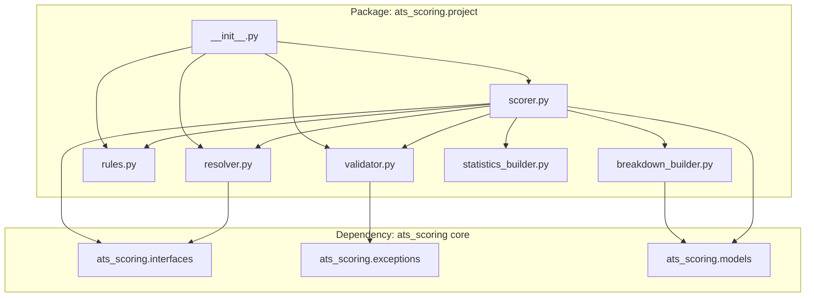

# Project Scorer Package Diagram

```mermaid
graph TD
    subgraph Package: ats_scoring.project
        __init__.py[__init__.py]
        scorer.py[scorer.py]
        resolver.py[resolver.py]
        rules.py[rules.py]
        validator.py[validator.py]
        breakdown_builder.py[breakdown_builder.py]
        statistics_builder.py[statistics_builder.py]
    end

    subgraph Dependency: ats_scoring core
        interfaces.py[ats_scoring.interfaces]
        exceptions.py[ats_scoring.exceptions]
        models.py[ats_scoring.models]
    end

    __init__.py --> scorer.py & resolver.py & rules.py & validator.py
    scorer.py --> resolver.py & rules.py & validator.py & breakdown_builder.py & statistics_builder.py
    scorer.py --> interfaces.py
    resolver.py --> interfaces.py
    validator.py --> exceptions.py
    breakdown_builder.py & scorer.py --> models.py
```
