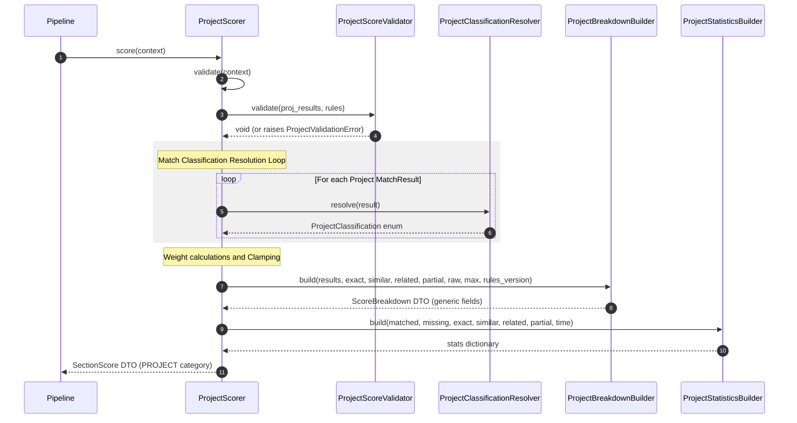

# Project Scorer Sequence Diagram

```mermaid
sequenceDiagram
    autonumber
    Pipeline ->> ProjectScorer: score(context)
    ProjectScorer ->> ProjectScorer: validate(context)
    ProjectScorer ->> ProjectScoreValidator: validate(proj_results, rules)
    ProjectScoreValidator -->> ProjectScorer: void (or raises ProjectValidationError)
    
    rect rgb(240, 240, 240)
        note over ProjectScorer: Match Classification Resolution Loop
        loop For each Project MatchResult
            ProjectScorer ->> ProjectClassificationResolver: resolve(result)
            ProjectClassificationResolver -->> ProjectScorer: ProjectClassification enum
        end
    end
    
    note over ProjectScorer: Weight calculations and Clamping
    ProjectScorer ->> ProjectBreakdownBuilder: build(results, exact, similar, related, partial, raw, max, rules_version)
    ProjectBreakdownBuilder -->> ProjectScorer: ScoreBreakdown DTO (generic fields)
    
    ProjectScorer ->> ProjectStatisticsBuilder: build(matched, missing, exact, similar, related, partial, time)
    ProjectStatisticsBuilder -->> ProjectScorer: stats dictionary
    
    ProjectScorer -->> Pipeline: SectionScore DTO (PROJECT category)
```
