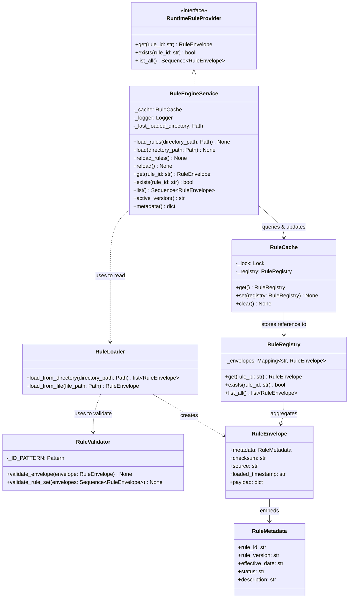

# Rule Engine Class Diagram

```mermaid
classDiagram
    class RuleEngineService {
        -_cache: RuleCache
        -_logger: Logger
        -_last_loaded_directory: Path
        +load_rules(directory_path: Path) None
        +load(directory_path: Path) None
        +reload_rules() None
        +reload() None
        +get(rule_id: str) RuleEnvelope
        +exists(rule_id: str) bool
        +list() Sequence~RuleEnvelope~
        +active_version() str
        +metadata() dict
    }

    class RuntimeRuleProvider {
        <<interface>>
        +get(rule_id: str) RuleEnvelope
        +exists(rule_id: str) bool
        +list_all() Sequence~RuleEnvelope~
    }

    class RuleLoader {
        +load_from_directory(directory_path: Path) list~RuleEnvelope~
        +load_from_file(file_path: Path) RuleEnvelope
    }

    class RuleValidator {
        -_ID_PATTERN: Pattern
        +validate_envelope(envelope: RuleEnvelope) None
        +validate_rule_set(envelopes: Sequence~RuleEnvelope~) None
    }

    class RuleRegistry {
        -_envelopes: Mapping~str, RuleEnvelope~
        +get(rule_id: str) RuleEnvelope
        +exists(rule_id: str) bool
        +list_all() list~RuleEnvelope~
    }

    class RuleCache {
        -_lock: Lock
        -_registry: RuleRegistry
        +get() RuleRegistry
        +set(registry: RuleRegistry) None
        +clear() None
    }

    class RuleMetadata {
        +rule_id: str
        +rule_version: str
        +effective_date: str
        +status: str
        +description: str
    }

    class RuleEnvelope {
        +metadata: RuleMetadata
        +checksum: str
        +source: str
        +loaded_timestamp: str
        +payload: dict
    }

    RuntimeRuleProvider <|.. RuleEngineService
    RuleEngineService --> RuleCache : queries & updates
    RuleCache --> RuleRegistry : stores reference to
    RuleRegistry --> RuleEnvelope : aggregates
    RuleEnvelope --> RuleMetadata : embeds
    RuleEngineService ..> RuleLoader : uses to read
    RuleLoader ..> RuleValidator : uses to validate
    RuleLoader ..> RuleEnvelope : creates
```
