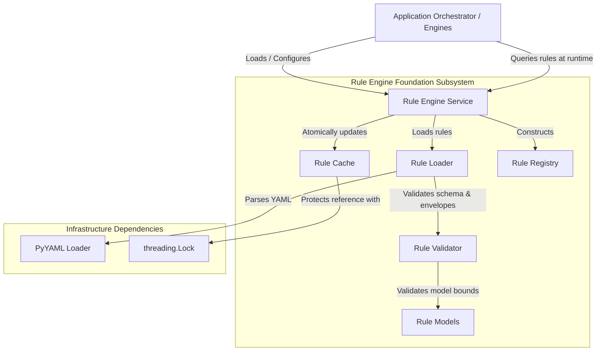

# Rule Engine Component Diagram

```mermaid
flowchart TD
    subgraph RuleEngineSystem [Rule Engine Foundation Subsystem]
        RES[Rule Engine Service]
        RC[Rule Cache]
        RL[Rule Loader]
        RV[Rule Validator]
        RR[Rule Registry]
        RM[Rule Models]
    end

    subgraph Infrastructure [Infrastructure Dependencies]
        StdYAML[PyYAML Loader]
        StdLock[threading.Lock]
    end

    App[Application Orchestrator / Engines] -->|Loads / Configures| RES
    App -->|Queries rules at runtime| RES

    RES -->|Loads rules| RL
    RL -->|Parses YAML| StdYAML
    RL -->|Validates schema & envelopes| RV
    RV -->|Validates model bounds| RM
    RES -->|Constructs| RR
    RES -->|Atomically updates| RC
    RC -->|Protects reference with| StdLock
```
