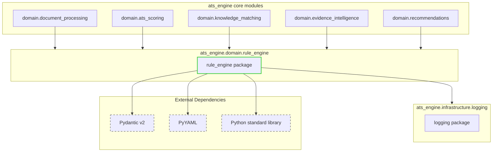

# Rule Engine Dependency Graph

```mermaid
flowchart TD
    subgraph RuleEngine [ats_engine.domain.rule_engine]
        RuleEnginePackage[rule_engine package]
    end

    subgraph Logging [ats_engine.infrastructure.logging]
        LoggingPackage[logging package]
    end

    subgraph Core [ats_engine core modules]
        Processing[domain.document_processing]
        Scoring[domain.ats_scoring]
        Matching[domain.knowledge_matching]
        Evidence[domain.evidence_intelligence]
        Recommendations[domain.recommendations]
    end

    subgraph External [External Dependencies]
        Pydantic[Pydantic v2]
        PyYAML[PyYAML]
        StdLib[Python standard library]
    end

    %% Dependency flow
    Processing --> RuleEngine
    Scoring --> RuleEngine
    Matching --> RuleEngine
    Evidence --> RuleEngine
    Recommendations --> RuleEngine

    RuleEnginePackage --> Logging
    RuleEnginePackage --> Pydantic
    RuleEnginePackage --> PyYAML
    RuleEnginePackage --> StdLib

    %% Verification assertions
    classDef safe stroke:#33cc33,stroke-width:2px;
    classDef external stroke:#333,stroke-dasharray: 5 5;
    class RuleEnginePackage safe;
    class Pydantic,PyYAML,StdLib external;
```
