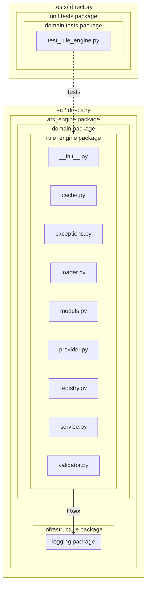

# Rule Engine Package Diagram

```mermaid
flowchart TD
    subgraph src [src/ directory]
        subgraph ats_engine [ats_engine package]
            subgraph domain [domain package]
                subgraph rule_engine [rule_engine package]
                    __init__.py
                    cache.py
                    exceptions.py
                    loader.py
                    models.py
                    provider.py
                    registry.py
                    service.py
                    validator.py
                end
            end
            subgraph infrastructure [infrastructure package]
                subgraph logging [logging package]
                end
            end
        end
    end

    subgraph tests [tests/ directory]
        subgraph unit [unit tests package]
            subgraph unit_domain [domain tests package]
                test_rule_engine.py
            end
        end
    end

    test_rule_engine.py -.->|Tests| rule_engine
    rule_engine -->|Uses| logging
```
