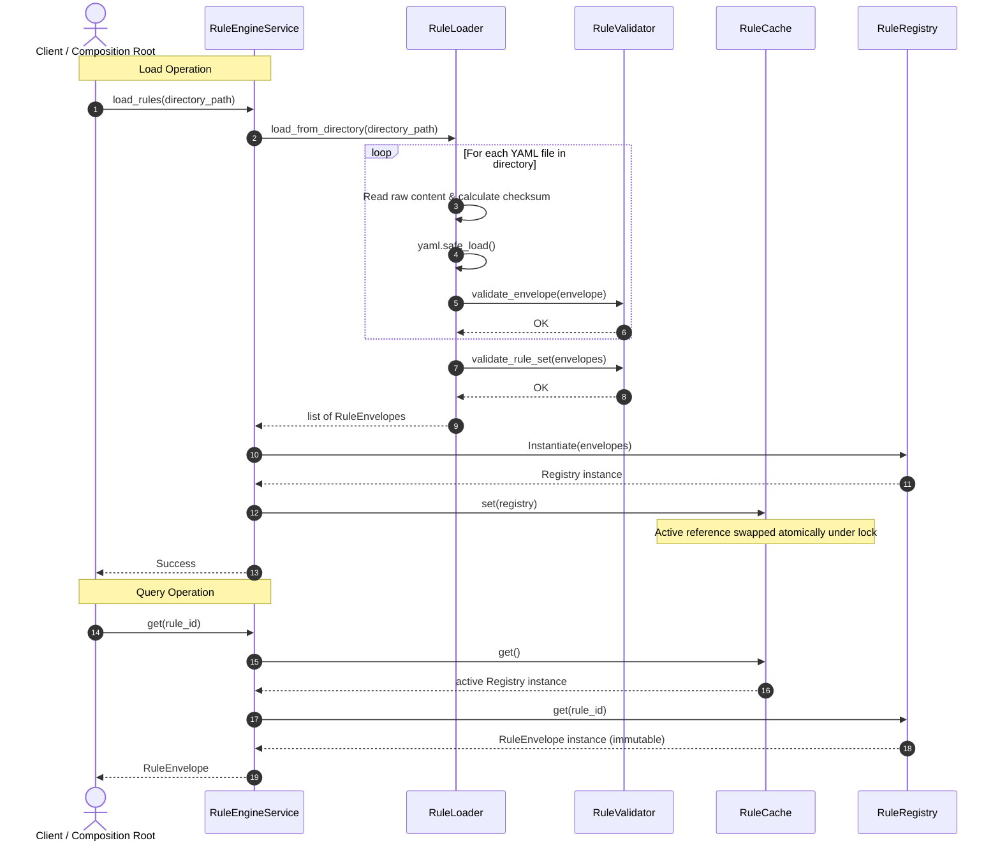

# Rule Engine Sequence Diagram

```mermaid
sequenceDiagram
    autonumber
    actor Client as Client / Composition Root
    participant Service as RuleEngineService
    participant Loader as RuleLoader
    participant Validator as RuleValidator
    participant Cache as RuleCache
    participant Registry as RuleRegistry

    Note over Client, Service: Load Operation
    Client->>Service: load_rules(directory_path)
    Service->>Loader: load_from_directory(directory_path)
    loop For each YAML file in directory
        Loader->>Loader: Read raw content & calculate checksum
        Loader->>Loader: yaml.safe_load()
        Loader->>Validator: validate_envelope(envelope)
        Validator-->>Loader: OK
    end
    Loader->>Validator: validate_rule_set(envelopes)
    Validator-->>Loader: OK
    Loader-->>Service: list of RuleEnvelopes
    Service->>Registry: Instantiate(envelopes)
    Registry-->>Service: Registry instance
    Service->>Cache: set(registry)
    Note over Cache: Active reference swapped atomically under lock
    Service-->>Client: Success

    Note over Client, Service: Query Operation
    Client->>Service: get(rule_id)
    Service->>Cache: get()
    Cache-->>Service: active Registry instance
    Service->>Registry: get(rule_id)
    Registry-->>Service: RuleEnvelope instance (immutable)
    Service-->>Client: RuleEnvelope
```
