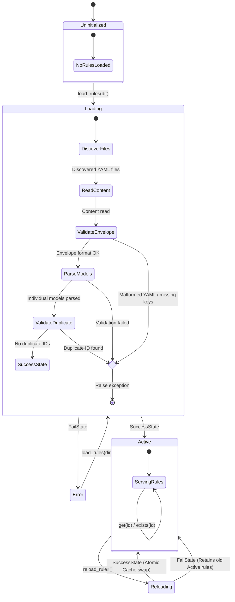

# Rule Engine State Diagram

```mermaid
stateDiagram-v2
    [*] --> Uninitialized

    state Uninitialized {
        [*] --> NoRulesLoaded
    }

    Uninitialized --> Loading : load_rules(dir)

    state Loading {
        [*] --> DiscoverFiles
        DiscoverFiles --> ReadContent : Discovered YAML files
        ReadContent --> ValidateEnvelope : Content read
        ValidateEnvelope --> ParseModels : Envelope format OK
        ParseModels --> ValidateDuplicate : Individual models parsed
        ValidateDuplicate --> SuccessState : No duplicate IDs
        
        state FailState <<choice>>
        ValidateEnvelope --> FailState : Malformed YAML / missing keys
        ParseModels --> FailState : Validation failed
        ValidateDuplicate --> FailState : Duplicate ID found
        FailState --> [*] : Raise exception
    }

    Loading --> Error : FailState
    Loading --> Active : SuccessState

    state Active {
        [*] --> ServingRules
        ServingRules --> ServingRules : get(id) / exists(id)
    }

    Active --> Reloading : reload_rules()
    Reloading --> Active : SuccessState (Atomic Cache swap)
    Reloading --> Active : FailState (Retains old Active rules)
    Error --> Loading : load_rules(dir)
```
