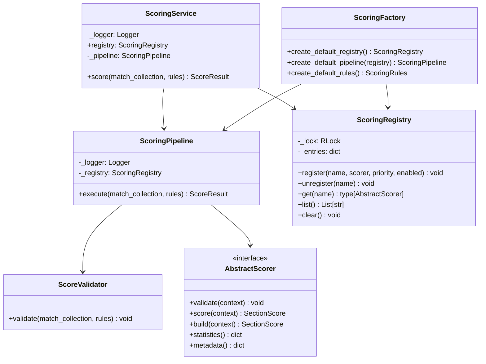

# Scoring Class Diagram

```mermaid
classDiagram
    direction TB
    class ScoringService {
        -_logger: Logger
        +registry: ScoringRegistry
        -_pipeline: ScoringPipeline
        +score(match_collection, rules) ScoreResult
    }
    class ScoringPipeline {
        -_logger: Logger
        -_registry: ScoringRegistry
        +execute(match_collection, rules) ScoreResult
    }
    class AbstractScorer {
        <<interface>>
        +validate(context) void
        +score(context) SectionScore
        +build(context) SectionScore
        +statistics() dict
        +metadata() dict
    }
    class ScoringRegistry {
        -_lock: RLock
        -_entries: dict
        +register(name, scorer, priority, enabled) void
        +unregister(name) void
        +get(name) type[AbstractScorer]
        +list() List[str]
        +clear() void
    }
    class ScoringFactory {
        +create_default_registry() ScoringRegistry
        +create_default_pipeline(registry) ScoringPipeline
        +create_default_rules() ScoringRules
    }
    class ScoreValidator {
        +validate(match_collection, rules) void
    }

    ScoringService --> ScoringPipeline
    ScoringService --> ScoringRegistry
    ScoringPipeline --> ScoreValidator
    ScoringPipeline --> AbstractScorer
    ScoringFactory --> ScoringRegistry
    ScoringFactory --> ScoringPipeline
```
