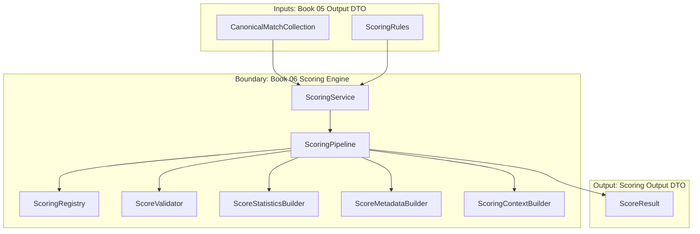

# Scoring Component Diagram

```mermaid
graph TD
    subgraph Boundary: Book 06 Scoring Engine
        Service[ScoringService]
        Pipeline[ScoringPipeline]
        Registry[ScoringRegistry]
        Validator[ScoreValidator]
        StatsBuilder[ScoreStatisticsBuilder]
        MetaBuilder[ScoreMetadataBuilder]
        ContextBuilder[ScoringContextBuilder]
    end

    subgraph Inputs: Book 05 Output DTO
        Collection[CanonicalMatchCollection]
        Rules[ScoringRules]
    end

    subgraph Output: Scoring Output DTO
        Result[ScoreResult]
    end

    Collection & Rules --> Service
    Service --> Pipeline
    Pipeline --> Validator
    Pipeline --> ContextBuilder
    Pipeline --> Registry
    Pipeline --> StatsBuilder
    Pipeline --> MetaBuilder
    Pipeline --> Result
```
