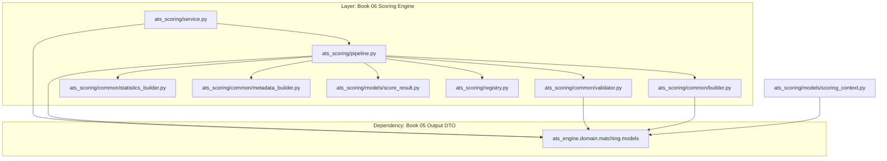

# Scoring Dependency Graph

```mermaid
graph TD
    subgraph Layer: Book 06 Scoring Engine
        ats_scoring/service.py --> ats_scoring/pipeline.py
        ats_scoring/pipeline.py --> ats_scoring/common/validator.py
        ats_scoring/pipeline.py --> ats_scoring/common/builder.py
        ats_scoring/pipeline.py --> ats_scoring/common/statistics_builder.py
        ats_scoring/pipeline.py --> ats_scoring/common/metadata_builder.py
        ats_scoring/pipeline.py --> ats_scoring/models/score_result.py
        ats_scoring/pipeline.py --> ats_scoring/registry.py
    end

    subgraph Dependency: Book 05 Output DTO
        matching/models.py[ats_engine.domain.matching.models]
    end

    ats_scoring/service.py & ats_scoring/pipeline.py & ats_scoring/common/validator.py & ats_scoring/common/builder.py & ats_scoring/models/scoring_context.py --> matching/models.py
```
