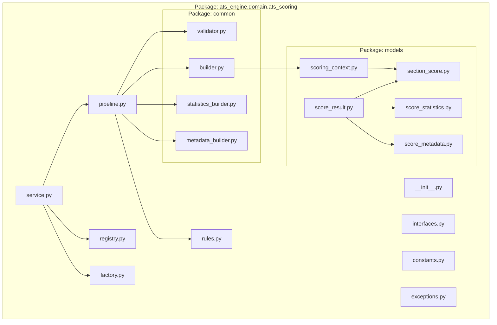

# Scoring Package Diagram

```mermaid
graph TD
    subgraph Package: ats_engine.domain.ats_scoring
        __init__.py[__init__.py]
        interfaces.py[interfaces.py]
        constants.py[constants.py]
        exceptions.py[exceptions.py]
        rules.py[rules.py]
        registry.py[registry.py]
        factory.py[factory.py]
        pipeline.py[pipeline.py]
        service.py[service.py]
        
        subgraph Package: models
            scoring_context.py[scoring_context.py]
            section_score.py[section_score.py]
            score_statistics.py[score_statistics.py]
            score_metadata.py[score_metadata.py]
            score_result.py[score_result.py]
        end
        
        subgraph Package: common
            validator.py[validator.py]
            builder.py[builder.py]
            statistics_builder.py[statistics_builder.py]
            metadata_builder.py[metadata_builder.py]
        end
    end

    service.py --> pipeline.py & registry.py & factory.py
    pipeline.py --> validator.py & builder.py & statistics_builder.py & metadata_builder.py & rules.py
    builder.py --> scoring_context.py
    scoring_context.py --> section_score.py
    score_result.py --> score_statistics.py & score_metadata.py & section_score.py
```
