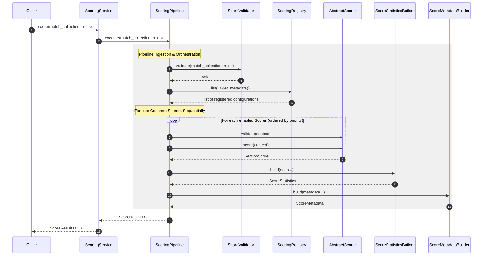

# Scoring Sequence Diagram

```mermaid
sequenceDiagram
    autonumber
    Caller ->> ScoringService: score(match_collection, rules)
    ScoringService ->> ScoringPipeline: execute(match_collection, rules)
    
    rect rgb(240, 240, 240)
        note over ScoringPipeline: Pipeline Ingestion & Orchestration
        ScoringPipeline ->> ScoreValidator: validate(match_collection, rules)
        ScoreValidator -->> ScoringPipeline: void
        
        ScoringPipeline ->> ScoringRegistry: list() / get_metadata()
        ScoringRegistry -->> ScoringPipeline: list of registered configurations
        
        note over ScoringPipeline: Execute Concrete Scorers Sequentially
        loop For each enabled Scorer (ordered by priority)
            ScoringPipeline ->> AbstractScorer: validate(context)
            ScoringPipeline ->> AbstractScorer: score(context)
            AbstractScorer -->> ScoringPipeline: SectionScore
        end
        
        ScoringPipeline ->> ScoreStatisticsBuilder: build(stats...)
        ScoreStatisticsBuilder -->> ScoringPipeline: ScoreStatistics
        
        ScoringPipeline ->> ScoreMetadataBuilder: build(metadata...)
        ScoreMetadataBuilder -->> ScoringPipeline: ScoreMetadata
    end
    
    ScoringPipeline -->> ScoringService: ScoreResult DTO
    ScoringService -->> Caller: ScoreResult DTO
```
