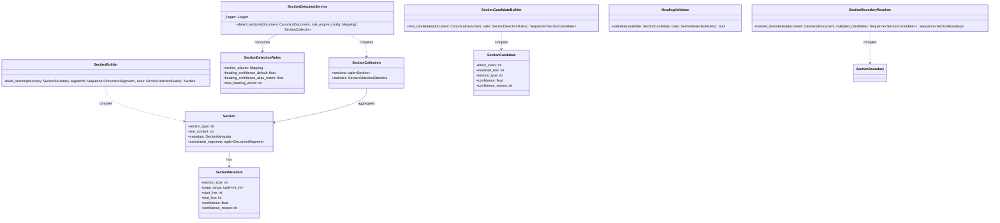

# Section Detection Class Diagram

**Version:** 1.0  
**Author:** Principal Software Engineer  
**Generated Date:** 2026-07-12  
**Related Handbook Chapter:** Book 03 — Entity Extraction  
**Related Milestone:** Milestone 3.3 — Document Section Detection  
**Status:** COMPLETE  

---

# Purpose

This document contains the class diagram for the section detection module.

---

# Architecture

