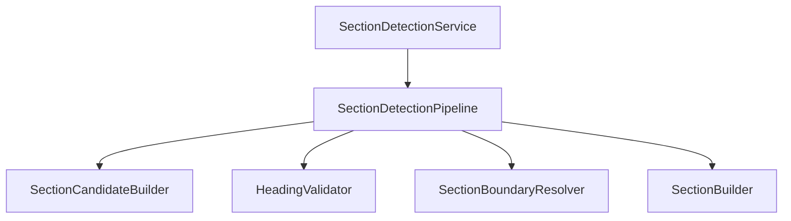
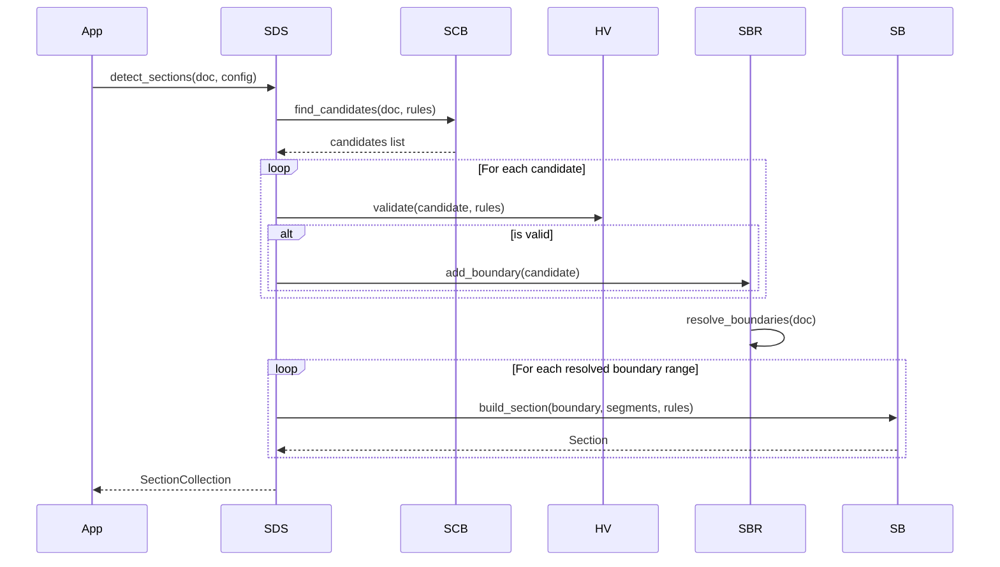

# Document Section Detection Design Document

**Version:** 1.0  
**Author:** Principal Software Engineer  
**Generated Date:** 2026-07-12  
**Related Handbook Chapter:** Book 03 — Entity Extraction  
**Related Milestone:** Milestone 3.3 — Document Section Detection  
**Status:** COMPLETE  

---

# Purpose

This document details the software design, logic pipeline, and boundary resolutions for logical section detection.

---

# Scope

### Included:
- Section candidate extraction heuristics.
- Heading validation restrictions.
- Reading order boundary resolution algorithms.
- Explainability parameters configurations.

### Not Included:
- Entity extraction from inside sections (skills, experience ranges).

---

# Background

Isolating document segments into logical sections (e.g. experience, summary, education) narrows search spans for downstream extractors. By applying configurable rules, we decouple physical layouts from semantic rules.

---

# Architecture

Stateless design utilizing independent single-purpose processors.



---

# Components

- **SectionCandidateBuilder:** Matches layout blocks against configured section aliases and heuristics.
- **HeadingValidator:** Rejects candidate matches failing basic length bounds.
- **SectionBoundaryResolver:** Iterates page segments to split boundaries, preserving reading order.
- **SectionBuilder:** Packages contiguous segments into logical `Section` models.

---

# Public Interfaces

`SectionDetectionService.detect_sections(document, config) -> SectionCollection`

---

# Internal Components

- `SectionBoundary`: intermediate boundary details.

---

# Data Flow

```
CanonicalDocument → Candidates Scan → Heuristic Filter → Group Segments → SectionCollection
```

---

# Sequence Flow



---

# Dependency Graph

Depends only on Book 02 models (`CanonicalDocument`, `DocumentSegment`).

---

# Design Decisions

- **Independent Repeated Sections:** Sections of identical types occurring non-contiguously (e.g. SKILLS ... EXPERIENCE ... SKILLS) remain separate rather than merged.
- **Explicit Confidence Reasoning:** Explanatory `confidence_reason` details why a confidence score was selected (e.g., matched configured alias).

---

# Validation

Validated via unit tests.

---

# Thread Safety

All processors maintain zero shared state.

---

# Error Handling

Explicit domain exceptions are raised: `HeadingValidationError`, `BoundaryResolutionError`, `SectionBuilderError`.

---

# Performance Considerations

Processed in $O(N)$ linear time.

---

# Testing

Test file: `tests/unit/domain/test_section_detection.py`.

---

# Verification Results

All tests completed successfully.

---

# Assumptions

Segment metadata line limits map correctly to absolute lines.

---

# Limitations

Supports vertical layouts only.

---

# Future Extension Points

Heuristic definitions and section aliases can be updated dynamically via Rule Engine files.

---

# Traceability

Satisfies Document Section Detection guidelines.

---

# Conclusion

Milestone 3.3 is complete and verified.
