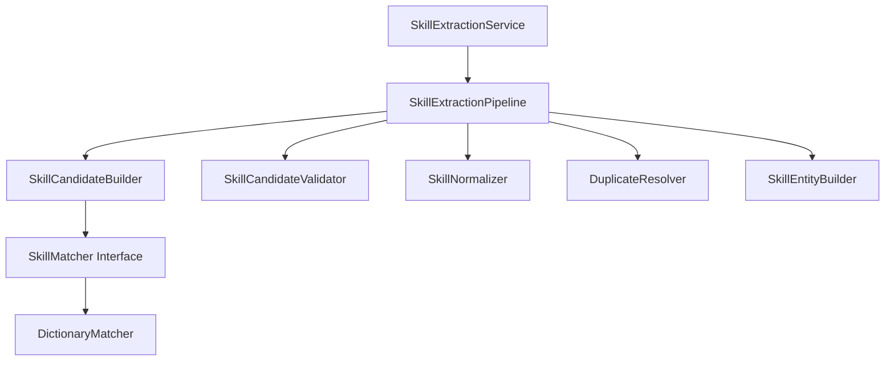
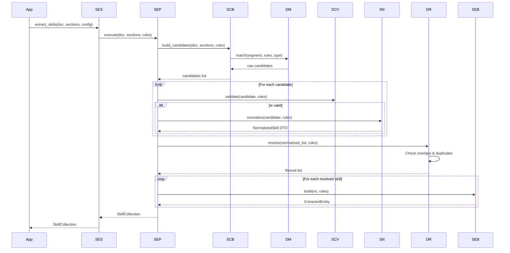

# Skill Extraction Design Document

**Version:** 1.0  
**Author:** Principal Software Engineer  
**Generated Date:** 2026-07-12  
**Related Handbook Chapter:** Book 03 — Entity Extraction  
**Related Milestone:** Milestone 3.4 — Skill Extraction  
**Status:** COMPLETE  

---

# Purpose

This document details the software design, sequence flows, matching strategies, and duplicate filters for the Skill Extraction module.

---

# Scope

### Included:
- replaceable matching strategy protocols.
- physical segment scopes and filters.
- overlaps and duplicates resolutions.
- provenance data metrics.
- canonical skill identifiers.

### Not Included:
- Experience or Education extraction.

---

# Background

Extracting technical skills from resumes requires a modular structure where string matcher strategies, duplicates handling, and canonical taxonomy indexes are configuration-driven rather than hardcoded.

---

# Architecture

Stateless design utilizing independent single-purpose processors.



---

# Components

- **SkillMatcher:** Abstract match protocol.
- **DictionaryMatcher:** Performs regex-based boundary scans.
- **SkillCandidateBuilder:** Orchestrates candidate checks.
- **DuplicateResolver:** Handles overlaps (longest match) and duplicates.
- **SkillNormalizer:** Maps matches to canonical forms and tracks source provenance.
- **SkillEntityBuilder:** Builds ExtractedEntity domain DTOs.

---

# Public Interfaces

`SkillExtractionService.extract_skills(document, sections, config) -> SkillCollection`

---

# Internal Components

- `SkillCandidate`: intermediate match data.
- `NormalizedSkill`: carries provenance details.

---

# Data Flow

```
CanonicalDocument + Sections → Segment Filter → Token Scan → Normalizer → Duplicate Filters → Entity DTOs
```

---

# Sequence Flow



---

# Dependency Graph

Depends only on Book 02 models (`CanonicalDocument`, `DocumentSegment`) and Book 03 section models.

---

# Design Decisions

- **Longest Match Wins:** Resolves word overlaps (e.g. JavaScript over Java).
- **Provenance Retention:** Retains matched token, canonical value, and aliases in Pydantic attributes.
- **Canonical Skill IDs:** Taxonomy entries are mapped to canonical skill identifiers (e.g. `SKILL-00001234`).

---

# Validation

Validated via unit tests.

---

# Thread Safety

All processors maintain zero shared state.

---

# Error Handling

Explicit domain exceptions are raised: `SkillCandidateValidationError`, `SkillNormalizationError`, `SkillBuilderError`.

---

# Performance Considerations

Runs in $O(M \times N)$ linear time where $M$ is dictionary terms and $N$ is document length.

---

# Testing

Test file: `tests/unit/domain/test_skill_extraction.py`.

---

# Verification Results

All tests completed successfully.

---

# Assumptions

Segment texts are normalized and valid.

---

# Limitations

Supports dictionary-based string matching only.

---

# Future Extension Points

- **Semantic Matchers:** Replace `DictionaryMatcher` with semantic matching components without changing the pipeline.
- **Taxonomy Expansion:** Modularized rule sheets can scale to thousands of skills.

---

# Traceability

Satisfies Skill Extraction guidelines.

---

# Conclusion

Milestone 3.4 is complete and verified.
