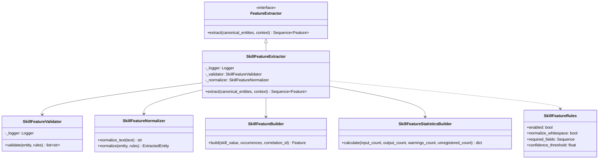

# Skill Feature Engineering Class Diagram

## Book 04 — Feature Engineering | Milestone 4.2

The class diagram outlines the interfaces and helper classes supporting `SkillFeatureExtractor`:

```mermaid
classDiagram
    class FeatureExtractor {
        <<interface>>
        +extract(canonical_entities, context) Sequence~Feature~
    }

    class SkillFeatureExtractor {
        -_logger: Logger
        -_validator: SkillFeatureValidator
        -_normalizer: SkillFeatureNormalizer
        +extract(canonical_entities, context) Sequence~Feature~
    }

    class SkillFeatureValidator {
        -_logger: Logger
        +validate(entity, rules) list~str~
    }

    class SkillFeatureNormalizer {
        +normalize_text(text) str
        +normalize(entity, rules) ExtractedEntity
    }

    class SkillFeatureBuilder {
        +build(skill_value, occurrences, correlation_id) Feature
    }

    class SkillFeatureStatisticsBuilder {
        +calculate(input_count, output_count, warnings_count, unregistered_count) dict
    }

    class SkillFeatureRules {
        +enabled: bool
        +normalize_whitespace: bool
        +required_fields: Sequence
        +confidence_threshold: float
    }

    FeatureExtractor <|-- SkillFeatureExtractor
    SkillFeatureExtractor --> SkillFeatureValidator
    SkillFeatureExtractor --> SkillFeatureNormalizer
    SkillFeatureExtractor --> SkillFeatureBuilder
    SkillFeatureExtractor --> SkillFeatureStatisticsBuilder
    SkillFeatureExtractor ..> SkillFeatureRules
```
