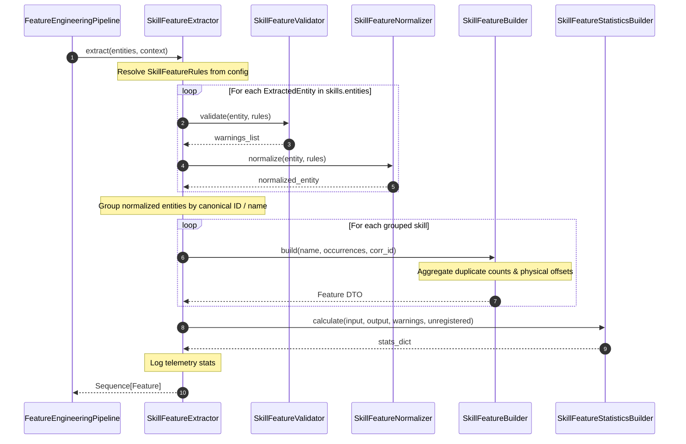

# Skill Feature Engineering Sequence Diagram

## Book 04 — Feature Engineering | Milestone 4.2

The timeline sequence below depicts the execution flow during skill feature extraction:

```mermaid
sequenceDiagram
    autonumber
    participant Pipeline as FeatureEngineeringPipeline
    participant Extractor as SkillFeatureExtractor
    participant Validator as SkillFeatureValidator
    participant Normalizer as SkillFeatureNormalizer
    participant Builder as SkillFeatureBuilder
    participant Stats as SkillFeatureStatisticsBuilder

    Pipeline ->> Extractor: extract(entities, context)
    Note over Extractor: Resolve SkillFeatureRules from config
    
    loop For each ExtractedEntity in skills.entities
        Extractor ->> Validator: validate(entity, rules)
        Validator -->> Extractor: warnings_list
        Extractor ->> Normalizer: normalize(entity, rules)
        Normalizer -->> Extractor: normalized_entity
    end

    Note over Extractor: Group normalized entities by canonical ID / name
    
    loop For each grouped skill
        Extractor ->> Builder: build(name, occurrences, corr_id)
        Note over Builder: Aggregate duplicate counts & physical offsets
        Builder -->> Extractor: Feature DTO
    end

    Extractor ->> Stats: calculate(input, output, warnings, unregistered)
    Stats -->> Extractor: stats_dict
    
    Note over Extractor: Log telemetry stats
    Extractor -->> Pipeline: Sequence[Feature]
```
