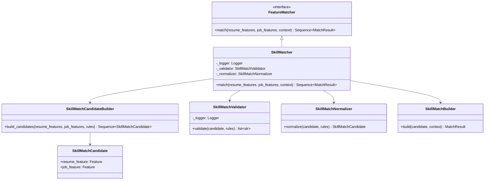

# Skill Matching Class Diagram

## Book 05 — Matching Engine | Milestone 5.2

The class diagram outlines the interfaces and helpers supporting the `SkillMatcher` component:

```mermaid
classDiagram
    class FeatureMatcher {
        <<interface>>
        +match(resume_features, job_features, context) Sequence~MatchResult~
    }

    class SkillMatcher {
        -_logger: Logger
        -_validator: SkillMatchValidator
        -_normalizer: SkillMatchNormalizer
        +match(resume_features, job_features, context) Sequence~MatchResult~
    }

    class SkillMatchCandidateBuilder {
        +build_candidates(resume_features, job_features, rules) Sequence~SkillMatchCandidate~
    }

    class SkillMatchCandidate {
        +resume_feature: Feature
        +job_feature: Feature
    }

    class SkillMatchValidator {
        -_logger: Logger
        +validate(candidate, rules) list~str~
    }

    class SkillMatchNormalizer {
        +normalize(candidate, rules) SkillMatchCandidate
    }

    class SkillMatchBuilder {
        +build(candidate, context) MatchResult
    }

    FeatureMatcher <|-- SkillMatcher
    SkillMatcher --> SkillMatchCandidateBuilder
    SkillMatcher --> SkillMatchValidator
    SkillMatcher --> SkillMatchNormalizer
    SkillMatcher --> SkillMatchBuilder
    SkillMatchCandidateBuilder --> SkillMatchCandidate
```
