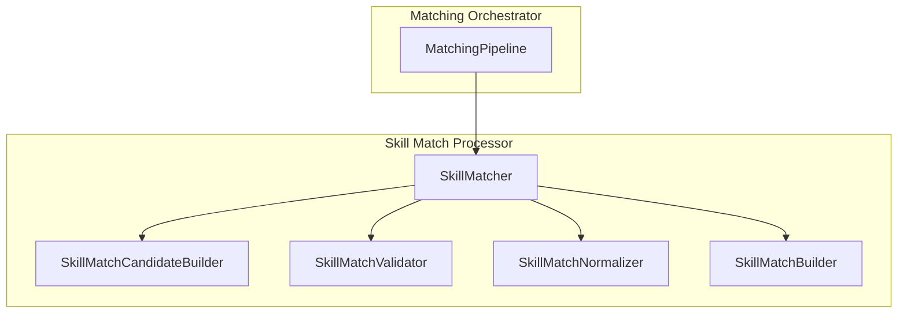

# Skill Matching Component Diagram

## Book 05 — Matching Engine | Milestone 5.2

The structural diagram details components within the Skill Match context:

```mermaid
graph TD
    subgraph "Matching Orchestrator"
        Pipeline["MatchingPipeline"]
    end

    subgraph "Skill Match Processor"
        Matcher["SkillMatcher"]
        Candidate["SkillMatchCandidateBuilder"]
        Validator["SkillMatchValidator"]
        Normalizer["SkillMatchNormalizer"]
        Builder["SkillMatchBuilder"]
    end

    Pipeline --> Matcher
    Matcher --> Candidate
    Matcher --> Validator
    Matcher --> Normalizer
    Matcher --> Builder
```
