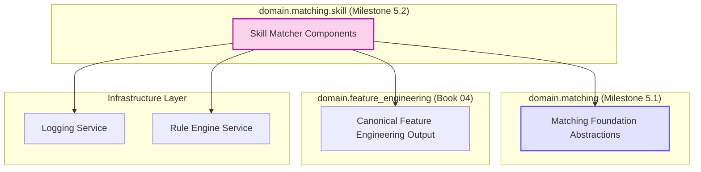

# Skill Matching Dependency Graph

## Book 05 — Matching Engine | Milestone 5.2

The dependency graph illustrates strict boundaries and dynamic registries:

```mermaid
graph TD
    subgraph "domain.matching.skill (Milestone 5.2)"
        SkillMatching["Skill Matcher Components"]
    end

    subgraph "domain.matching (Milestone 5.1)"
        MatchingFoundation["Matching Foundation Abstractions"]
    end

    subgraph "domain.feature_engineering (Book 04)"
        CanonicalFeature["Canonical Feature Engineering Output"]
    end

    subgraph "Infrastructure Layer"
        Logging["Logging Service"]
        RuleEngine["Rule Engine Service"]
    end

    SkillMatching --> MatchingFoundation
    SkillMatching --> CanonicalFeature
    SkillMatching --> Logging
    SkillMatching --> RuleEngine

    %% Style representations
    style SkillMatching fill:#fcd1ec,stroke:#b817a2,stroke-width:2px
    style MatchingFoundation fill:#e2e2fc,stroke:#5c5cfc,stroke-width:2px
```
