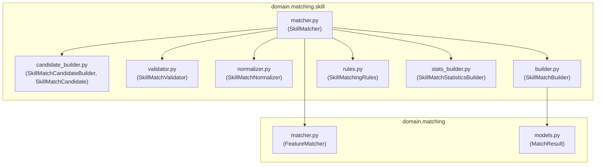

# Skill Matching Package Diagram

## Book 05 — Matching Engine | Milestone 5.2

The package layout shows organized classes and files under `matching/skill/`:

```mermaid
graph TD
    subgraph "domain.matching.skill"
        Matcher["matcher.py<br/>(SkillMatcher)"]
        Candidate["candidate_builder.py<br/>(SkillMatchCandidateBuilder, SkillMatchCandidate)"]
        Validator["validator.py<br/>(SkillMatchValidator)"]
        Normalizer["normalizer.py<br/>(SkillMatchNormalizer)"]
        Builder["builder.py<br/>(SkillMatchBuilder)"]
        Rules["rules.py<br/>(SkillMatchingRules)"]
        Stats["stats_builder.py<br/>(SkillMatchStatisticsBuilder)"]
    end

    subgraph "domain.matching"
        BaseMatcher["matcher.py<br/>(FeatureMatcher)"]
        Models["models.py<br/>(MatchResult)"]
    end

    Matcher --> BaseMatcher
    Matcher --> Candidate
    Matcher --> Validator
    Matcher --> Normalizer
    Matcher --> Builder
    Matcher --> Rules
    Matcher --> Stats
    Builder --> Models
```
