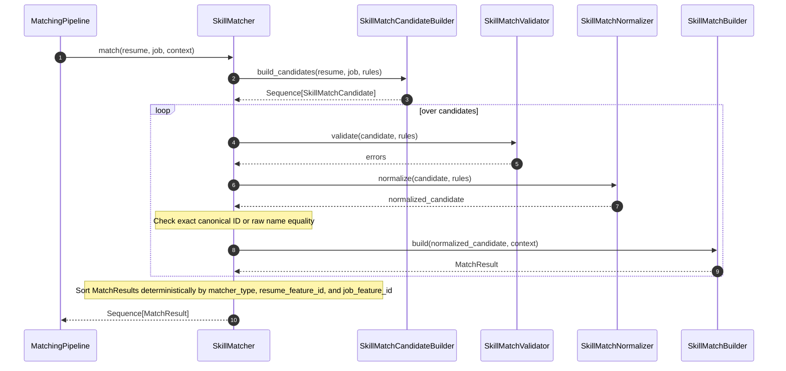

# Skill Matching Sequence Diagram

## Book 05 — Matching Engine | Milestone 5.2

The sequence diagram details pipeline calls executing the SkillMatcher:

```mermaid
sequenceDiagram
    autonumber
    participant Pipeline as MatchingPipeline
    participant Matcher as SkillMatcher
    participant Candidate as SkillMatchCandidateBuilder
    participant Validator as SkillMatchValidator
    participant Normalizer as SkillMatchNormalizer
    participant Builder as SkillMatchBuilder

    Pipeline ->> Matcher: match(resume, job, context)
    Matcher ->> Candidate: build_candidates(resume, job, rules)
    Candidate -->> Matcher: Sequence[SkillMatchCandidate]
    Loop over candidates
        Matcher ->> Validator: validate(candidate, rules)
        Validator -->> Matcher: errors
        Matcher ->> Normalizer: normalize(candidate, rules)
        Normalizer -->> Matcher: normalized_candidate
        Note over Matcher: Check exact canonical ID or raw name equality
        Matcher ->> Builder: build(normalized_candidate, context)
        Builder -->> Matcher: MatchResult
    End
    Note over Matcher: Sort MatchResults deterministically by matcher_type, resume_feature_id, and job_feature_id
    Matcher -->> Pipeline: Sequence[MatchResult]
```
