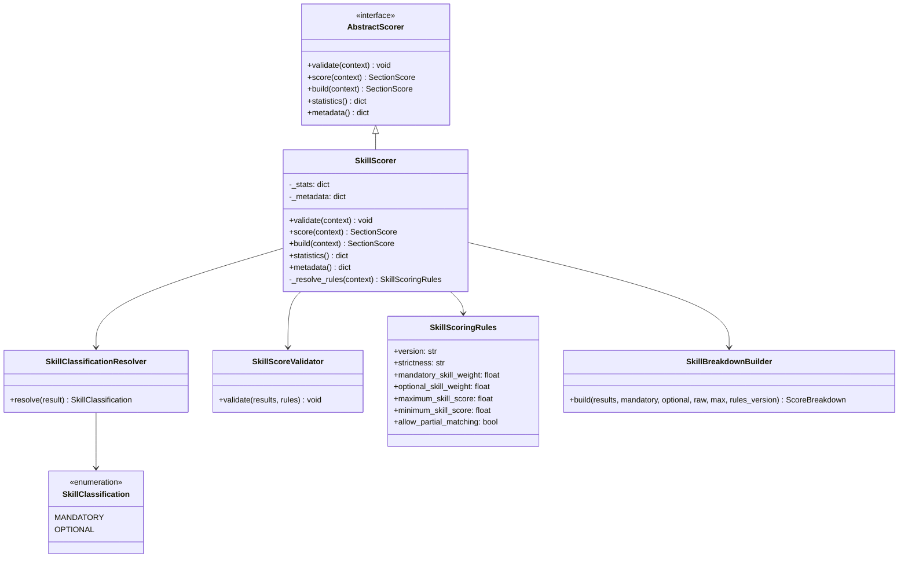

# Skill Scorer Class Diagram

```mermaid
classDiagram
    direction TB
    class AbstractScorer {
        <<interface>>
        +validate(context) void
        +score(context) SectionScore
        +build(context) SectionScore
        +statistics() dict
        +metadata() dict
    }
    class SkillScorer {
        -_stats: dict
        -_metadata: dict
        +validate(context) void
        +score(context) SectionScore
        +build(context) SectionScore
        +statistics() dict
        +metadata() dict
        -_resolve_rules(context) SkillScoringRules
    }
    class SkillClassificationResolver {
        +resolve(result) SkillClassification
    }
    class SkillClassification {
        <<enumeration>>
        MANDATORY
        OPTIONAL
    }
    class SkillScoreValidator {
        +validate(results, rules) void
    }
    class SkillScoringRules {
        +version: str
        +strictness: str
        +mandatory_skill_weight: float
        +optional_skill_weight: float
        +maximum_skill_score: float
        +minimum_skill_score: float
        +allow_partial_matching: bool
    }
    class SkillBreakdownBuilder {
        +build(results, mandatory, optional, raw, max, rules_version) ScoreBreakdown
    }

    AbstractScorer <|-- SkillScorer
    SkillScorer --> SkillClassificationResolver
    SkillScorer --> SkillScoreValidator
    SkillScorer --> SkillScoringRules
    SkillScorer --> SkillBreakdownBuilder
    SkillClassificationResolver --> SkillClassification
```
