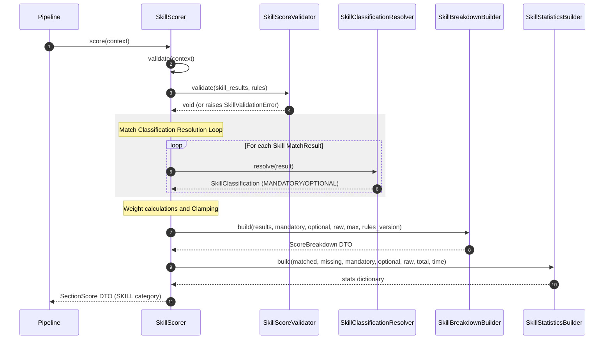

# Skill Scorer Sequence Diagram

```mermaid
sequenceDiagram
    autonumber
    Pipeline ->> SkillScorer: score(context)
    SkillScorer ->> SkillScorer: validate(context)
    SkillScorer ->> SkillScoreValidator: validate(skill_results, rules)
    SkillScoreValidator -->> SkillScorer: void (or raises SkillValidationError)
    
    rect rgb(240, 240, 240)
        note over SkillScorer: Match Classification Resolution Loop
        loop For each Skill MatchResult
            SkillScorer ->> SkillClassificationResolver: resolve(result)
            SkillClassificationResolver -->> SkillScorer: SkillClassification (MANDATORY/OPTIONAL)
        end
    end
    
    note over SkillScorer: Weight calculations and Clamping
    SkillScorer ->> SkillBreakdownBuilder: build(results, mandatory, optional, raw, max, rules_version)
    SkillBreakdownBuilder -->> SkillScorer: ScoreBreakdown DTO
    
    SkillScorer ->> SkillStatisticsBuilder: build(matched, missing, mandatory, optional, raw, total, time)
    SkillStatisticsBuilder -->> SkillScorer: stats dictionary
    
    SkillScorer -->> Pipeline: SectionScore DTO (SKILL category)
```
