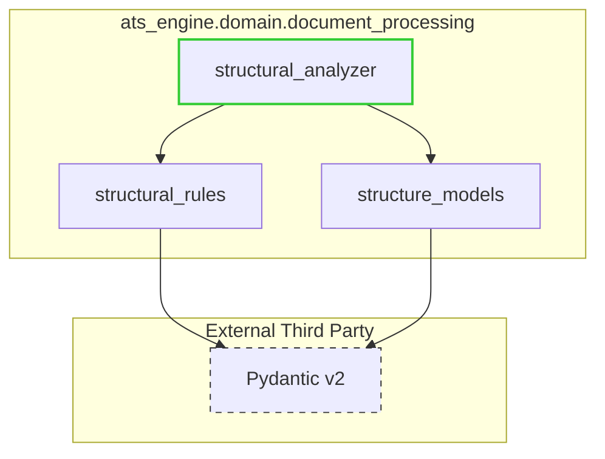

# Structural Analysis Dependency Graph

**Version:** 1.0  
**Author:** Principal Software Engineer  
**Generated Date:** 2026-07-12  
**Related Handbook Chapter:** Book 02 — Document Processing  
**Related Milestone:** Milestone 2.2 — Resume & JD Structural Analysis  
**Status:** COMPLETE  

---

# Purpose

This document details the dependencies of the structural analysis layer.

---

# Dependency Graph

