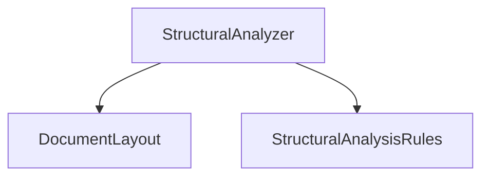
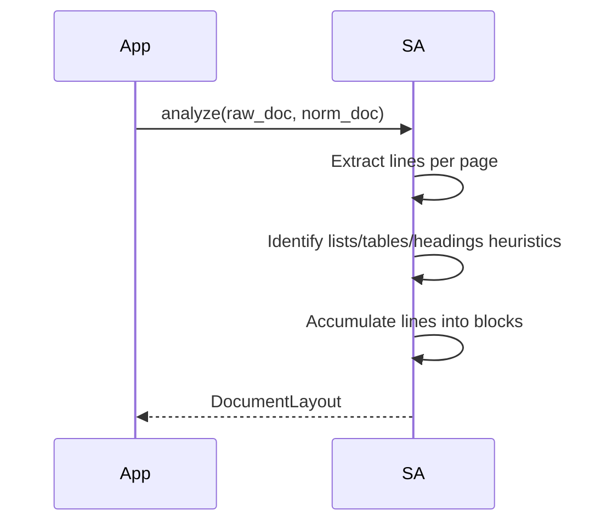

# Structural Analysis Design Document

**Version:** 1.0  
**Author:** Principal Software Engineer  
**Generated Date:** 2026-07-12  
**Related Handbook Chapter:** Book 02 — Document Processing  
**Related Milestone:** Milestone 2.2 — Resume & JD Structural Analysis  
**Status:** COMPLETE  

---

# Purpose

This document details the software design, heuristics, and components of the Document Processing Structural Analysis layer.

---

# Scope

### Included:
- Line classification and parsing schemas.
- Block grouping algorithms.
- Page index map preservation.
- Rule payload mappings.

### Not Included:
- Section labeling (experience, skills, projects) or regex semantic parsers.

---

# Background

To classify and score information correctly, the engine must isolate sections. The physical block analysis decomposes text ranges into paragraphs, headings, bullet lists, and tables without assigning semantic meanings.

---

# Architecture

Stateless design utilizing raw input page arrays and layout rules.



---

# Components

- **StructuralAnalyzer:** Exposes the bootstrap layout pipeline.
- **StructuralAnalysisRules:** Contains thresholds for lengths, symbols, and pattern regexes.

---

# Public Interfaces

`StructuralAnalyzer.analyze(raw_document, normalized_document) -> DocumentLayout`

---

# Internal Components

- `PhysicalLine`: Encapsulates text lines and indentation properties.
- `PhysicalBlock`: Sequence of lines with identical layout roles.

---

# Data Flow

```
Normalized Text → Line Extraction → Property Tagging → Grouping → DocumentLayout
```

---

# Sequence Flow



---

# Dependency Graph

Compiles with zero dependencies on other business engines.

---

# Design Decisions

- **GIL-Safe Stateless Processing:** The class holds no state and operates safely in a multi-threaded daemon context.
- **Pydantic Validation:** Models use frozen config validation checks to guarantee state immutability.

---

# Validation

Validated via unit tests simulating layout blocks.

---

# Thread Safety

The analyzer maintains zero instance state.

---

# Error Handling

Returns validation exceptions for corrupt schemas.

---

# Performance Considerations

Splits are processed within a single pass ($O(N)$ complexity where $N$ is line count).

---

# Testing

Test file: `tests/unit/domain/test_structural_analysis.py`.

---

# Verification Results

All tests completed successfully.

---

# Assumptions

Page arrays match the logical reading sequence.

---

# Limitations

Only left-to-right languages are supported.

---

# Future Extension Points

Heuristic definitions can be customized via the rule files dynamically.

---

# Traceability

Satisfies Document Layout analysis guidelines.

---

# Conclusion

Milestone 2.2 is complete and verified.
